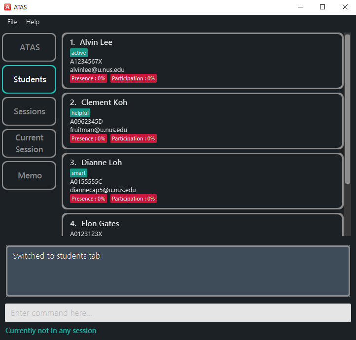

# ATAS

**Addendum for Teaching Assistants (ATAS)** is a desktop application that aims to *elevate* user's efficiency and make their experience of handling administrative tasks in classes as seamless as possible. It has a GUI but most of the user interactions happen using a CLI (Command Line Interface).

In the current version, **ATAS** targets NUS Teaching Assistants (TAs) that are teaching the CS1010S module.

With **ATAS**, users can manage students' particulars, track students' attendance and in-class participation, take down notes and many more.

* If you are interested in using **ATAS**, head over to the [_Quick Start_ section of the **User Guide**](https://ay2021s1-cs2103t-w16-4.github.io/tp/UserGuide.html#3-quick-start).
* If you are interested in developing **ATAS**, the [**Developer Guide**](https://ay2021s1-cs2103t-w16-4.github.io/tp/DeveloperGuide.html) is a good place to start.

## Site Map
* [User Guide](https://ay2021s1-cs2103t-w16-4.github.io/tp/UserGuide.html)
* [Developer Guide](https://ay2021s1-cs2103t-w16-4.github.io/tp/DeveloperGuide.html)
* [About Us](https://ay2021s1-cs2103t-w16-4.github.io/tp/AboutUs.html)

## Acknowledgments
* This project is based on the AddressBook-Level3 project created by the [SE-EDU initiative](https://se-education.org).
* Libraries used: [JavaFX](https://openjfx.io/), [Jackson](https://github.com/FasterXML/jackson), [JUnit5](https://github.com/junit-team/junit5)
