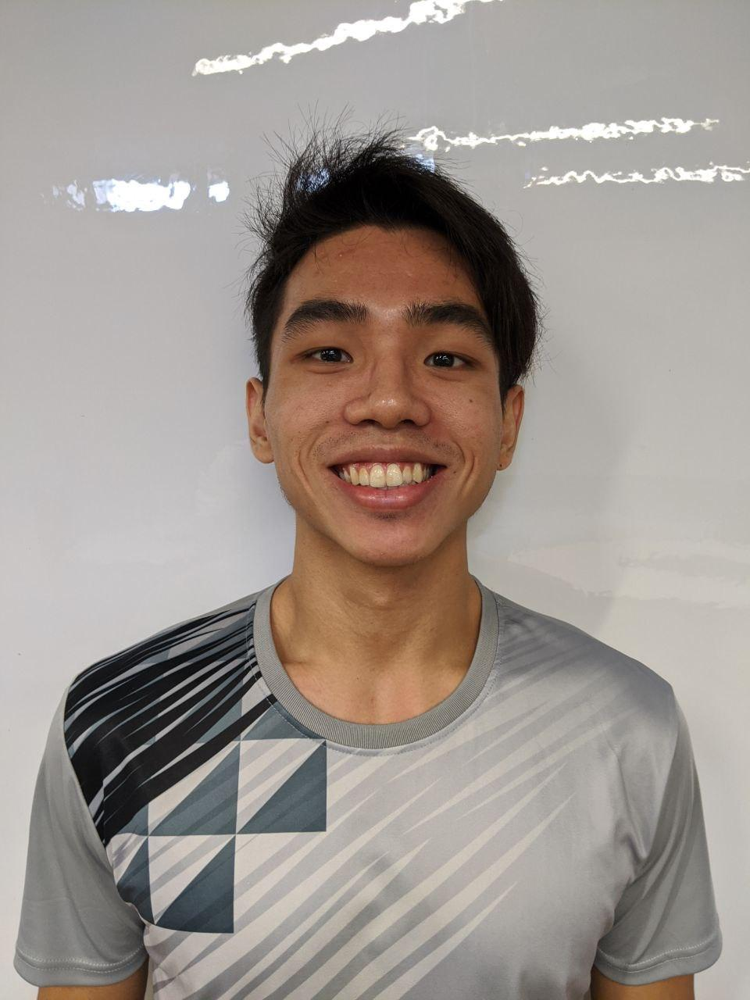
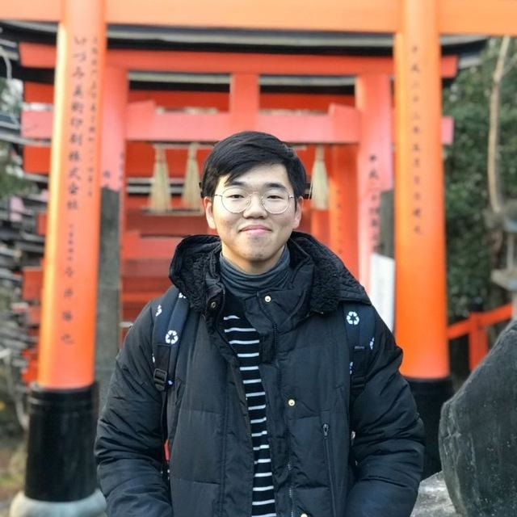
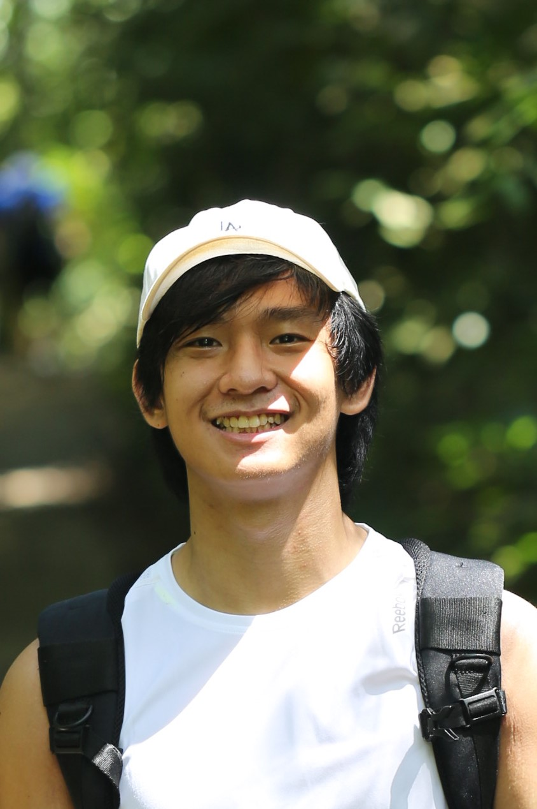
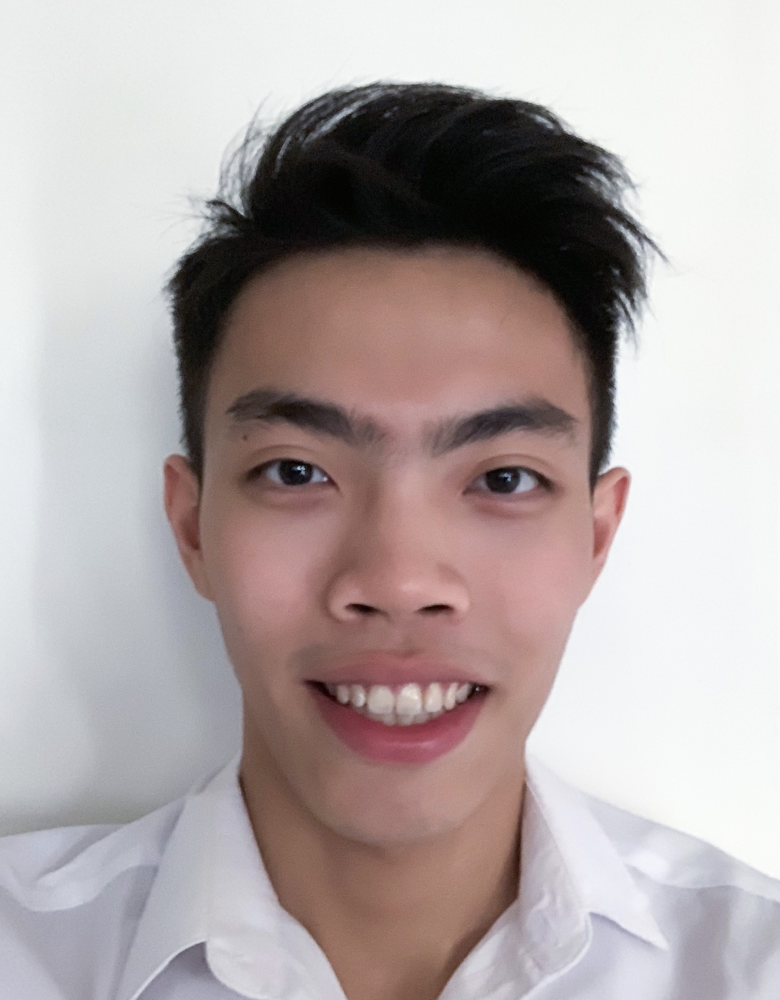
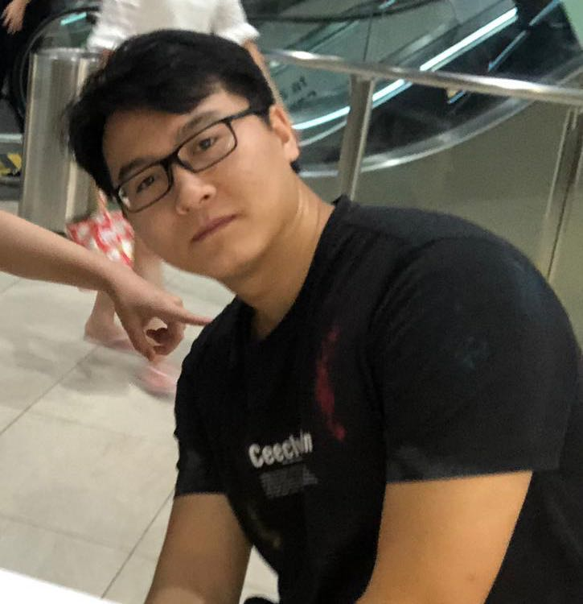

We are a team based in the [School of Computing, National University of Singapore](http://www.comp.nus.edu.sg).

You can reach us at the email `e0406158@u.nus.edu`

## Project team

### Alvin Chee

[[github](https://github.com/CodingCookieRookie)]
[[portfolio](team/johndoe.md)]

* Role: Integrator
* Responsibilities: Integration

### Marcus Tan

[[github](http://github.com/marcustw)]
[[portfolio](team/johndoe.md)]

* Role: Testing
* Responsibilities: Looks after testing and ensures the testing of the project is done properly and on time.

### Masagca Eris Jacey Dumasis

[[github](http://github.com/erisjacey)]
[[portfolio](team/johndoe.md)]

* Role: Team Lead; Code Quality; Deliverables and Deadlines
* Responsibilities:
   * Responsible for overall project coordination
   * Looks after code quality, ensures adherance to coding standards, etc.
   * Ensures project deliverables are done on time and in the right format 

### Ngoh Wei Yue

[[github](http://github.com/nweiyue)]
[[portfolio](team/johndoe.md)]

* Role: Documentation
* Responsibilities: Looks after the quality of various project documents like user and developer guides

### Zhang Sheng Yang

[[github](http://github.com/YuunoKun)]
[[portfolio](team/johndoe.md)]

* Role: Tech lead
* Responsibilities: Write Code
