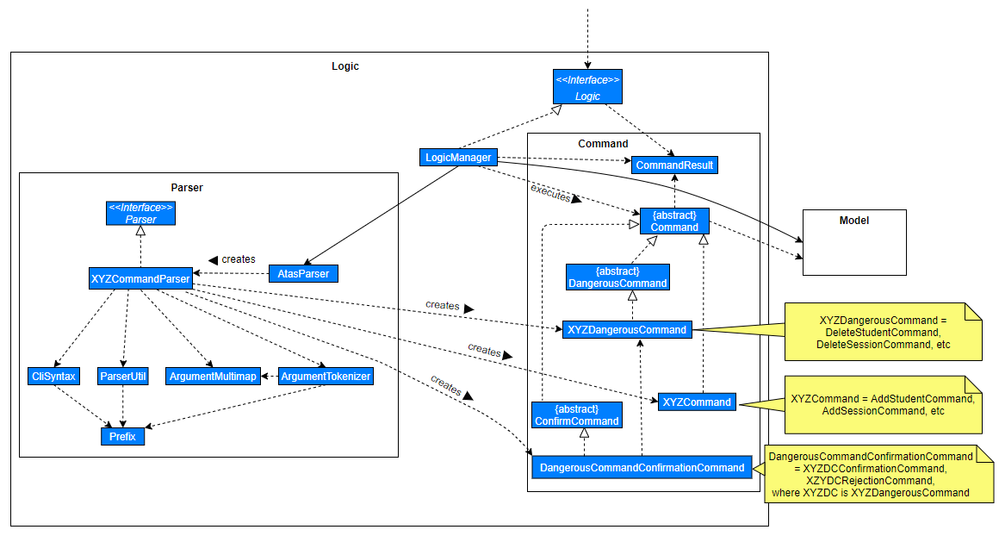
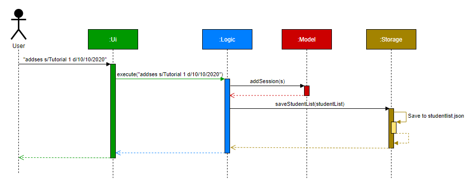
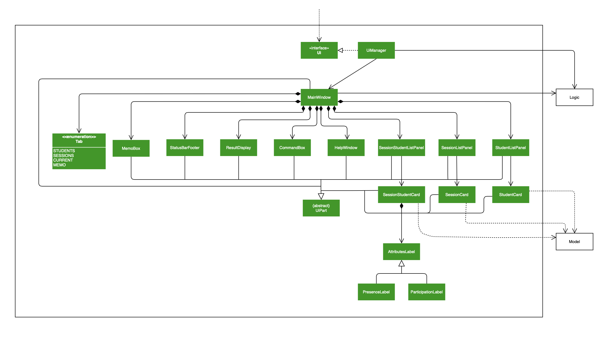
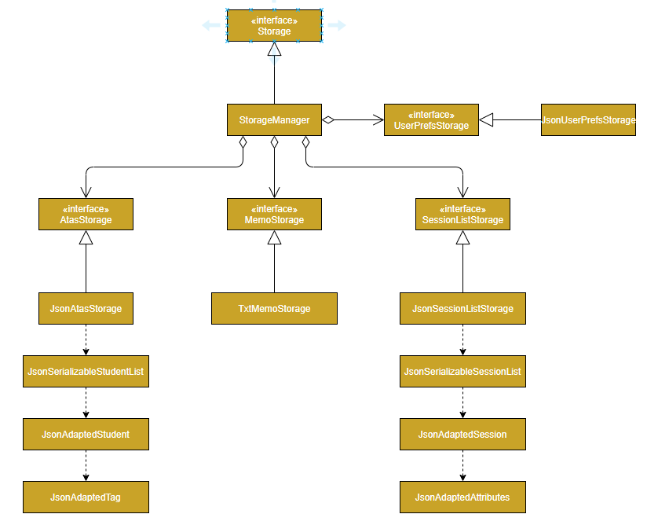
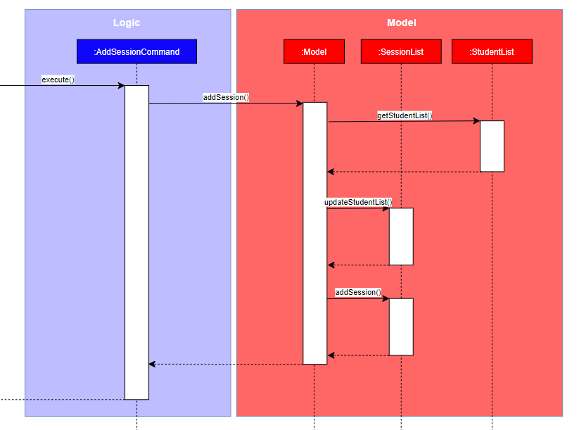

* [**Setting up, getting started**](#su_gs)
* [**Design**](#design)
   * [Architecture](#architecture)
   * [UI component](#ui_component)
   * [Logic component](#logic_component)
   * [Model component](#model_component)
   * [Storage component](#storage_component)
   * [Common classes](#common_classes)
* [**Implementation**](#implementation)
   * [[Proposed] Undo/redo feature](#undo_redo)
     * [Proposed Implementation](#proposed_implementation)
     * [Design consideration:](#design_consideration)
       * [Aspect: How undo & redo executes](#aspect_undo_redo)
  * [[Proposed] Data archiving](#data_archiving)
  * [Adding a session](#adding_a_session)
* [**Documentation, logging, testing, configuration, dev-ops**](#documentation_etc)
* [**Appendix: Requirements**](#appendix_requirements)
  * [Product scope](#product_scope)
  * [User stories](#user_stories)
  * [Use cases](#use_cases)
  * [Non-Functional Requirements](#nfr)
  * [Glossary](#glossary)
* [**Appendix: Instructions for manual testing**](#appendix_manual_testing)
  * [Launch and shutdown](#launch_shutdown)
  * [Deleting a student](#deleting_a_student)
  * [Saving data](#saving_data)

--------------------------------------------------------------------------------------------------------------------

## **Setting up, getting started**

Refer to the guide [_Setting up and getting started_](SettingUp.md).

--------------------------------------------------------------------------------------------------------------------

## **Design**

### Architecture

The ***Architecture Diagram*** given above explains the high-level design of the App. Given below is a quick overview of each component.

:bulb: **Tip:** The `.puml` files used to create diagrams in this document can be found in the [diagrams](https://github.com/se-edu/addressbook-level3/tree/master/docs/diagrams/) folder. Refer to the [_PlantUML Tutorial_ at se-edu/guides](https://se-education.org/guides/tutorials/plantUml.html) to learn how to create and edit diagrams.

**`Main`** has two classes called [`Main`](https://github.com/se-edu/addressbook-level3/tree/master/src/main/java/seedu/address/Main.java) and [`MainApp`](https://github.com/se-edu/addressbook-level3/tree/master/src/main/java/seedu/address/MainApp.java). It is responsible for,
* At app launch: Initializes the components in the correct sequence, and connects them up with each other.
* At shut down: Shuts down the components and invokes cleanup methods where necessary.

[**`Commons`**](#common-classes) represents a collection of classes used by multiple other components.

The rest of the App consists of four components.

* [**`UI`**](#ui-component): The UI of the App.
* [**`Logic`**](#logic-component): The command executor.
* [**`Model`**](#model-component): Holds the data of the App in memory.
* [**`Storage`**](#storage-component): Reads data from, and writes data to, the hard disk.

Each of the four components,

* defines its *API* in an `interface` with the same name as the Component.
* exposes its functionality using a concrete `{Component Name}Manager` class (which implements the corresponding API `interface` mentioned in the previous point.

For example, the `Logic` component (see the class diagram given below) defines its API in the `Logic.java` interface and exposes its functionality using the `LogicManager.java` class which implements the `Logic` interface.

**How the architecture components interact with each other**

The *Sequence Diagram* below shows how the components interact with each other for the scenario where the user issues the command `delete 1`.

The sections below give more details of each component.

### UI component

**API** :
[`Ui.java`](https://github.com/se-edu/addressbook-level3/tree/master/src/main/java/seedu/address/ui/Ui.java)

The UI consists of a `MainWindow` that is made up of parts e.g.`CommandBox`, `ResultDisplay`, `PersonListPanel`, `StatusBarFooter` etc. All these, including the `MainWindow`, inherit from the abstract `UiPart` class.

The `UI` component uses JavaFx UI framework. The layout of these UI parts are defined in matching `.fxml` files that are in the `src/main/resources/view` folder. For example, the layout of the [`MainWindow`](https://github.com/se-edu/addressbook-level3/tree/master/src/main/java/seedu/address/ui/MainWindow.java) is specified in [`MainWindow.fxml`](https://github.com/se-edu/addressbook-level3/tree/master/src/main/resources/view/MainWindow.fxml)

The `UI` component,

* Executes user commands using the `Logic` component.
* Listens for changes to `Model` data so that the UI can be updated with the modified data.

### Logic component

**API** :
[`Logic.java`](https://github.com/se-edu/addressbook-level3/tree/master/src/main/java/seedu/address/logic/Logic.java)

1. `Logic` uses the `AddressBookParser` class to parse the user command.
1. This results in a `Command` object which is executed by the `LogicManager`.
1. The command execution can affect the `Model` (e.g. adding a student).
1. The result of the command execution is encapsulated as a `CommandResult` object which is passed back to the `Ui`.
1. In addition, the `CommandResult` object can also instruct the `Ui` to perform certain actions, such as displaying help to the user.

Given below is the Sequence Diagram for interactions within the `Logic` component for the `execute("delete 1")` API call.

:information_source: **Note:** The lifeline for `DeleteCommandParser` should end at the destroy marker (X) but due to a limitation of PlantUML, the lifeline reaches the end of diagram.

### Model component

**API** : [`Model.java`](https://github.com/se-edu/addressbook-level3/tree/master/src/main/java/seedu/address/model/Model.java)

The `Model`,

* stores a `UserPref` object that represents the user’s preferences.
* stores the address book data.
* exposes an unmodifiable `ObservableList<Person>` that can be 'observed' e.g. the UI can be bound to this list so that the UI automatically updates when the data in the list change.
* does not depend on any of the other three components.

:information_source: **Note:** An alternative (arguably, a more OOP) model is given below. It has a `Tag` list in the `AddressBook`, which `Person` references. This allows `AddressBook` to only require one `Tag` object per unique `Tag`, instead of each `Person` needing their own `Tag` object. 

### Storage component

**API** : [`Storage.java`](https://github.com/AY2021S1-CS2103T-W16-4/tp/blob/master/src/main/java/atas/storage/Storage.java)

The `Storage` component,
* can save `UserPref` objects in json format and read it back.
* can save the student list data in json format and read it back.
* can save the session list data in json format and read it back.
* can save the memo data in txt file and read it back.

### Common classes

Classes used by multiple components are in the `seedu.atas.commons` package.

--------------------------------------------------------------------------------------------------------------------

## **Implementation**

This section describes some noteworthy details on how certain features are implemented.

### \[Proposed\] Undo/redo feature

#### Proposed Implementation

The proposed undo/redo mechanism is facilitated by `VersionedAddressBook`. It extends `AddressBook` with an undo/redo history, stored internally as an `addressBookStateList` and `currentStatePointer`. Additionally, it implements the following operations:

* `VersionedAddressBook#commit()` — Saves the current address book state in its history.
* `VersionedAddressBook#undo()` — Restores the previous address book state from its history.
* `VersionedAddressBook#redo()` — Restores a previously undone address book state from its history.

These operations are exposed in the `Model` interface as `Model#commitAddressBook()`, `Model#undoAddressBook()` and `Model#redoAddressBook()` respectively.

Given below is an example usage scenario and how the undo/redo mechanism behaves at each step.

Step 1. The user launches the application for the first time. The `VersionedAddressBook` will be initialized with the initial address book state, and the `currentStatePointer` pointing to that single address book state.

Step 2. The user executes `delete 5` command to delete the 5th student in the address book. The `delete` command calls `Model#commitAddressBook()`, causing the modified state of the address book after the `delete 5` command executes to be saved in the `addressBookStateList`, and the `currentStatePointer` is shifted to the newly inserted address book state.

Step 3. The user executes `add n/David …​` to add a new student. The `add` command also calls `Model#commitAddressBook()`, causing another modified address book state to be saved into the `addressBookStateList`.

:information_source: **Note:** If a command fails its execution, it will not call `Model#commitAddressBook()`, so the address book state will not be saved into the `addressBookStateList`.

Step 4. The user now decides that adding the student was a mistake, and decides to undo that action by executing the `undo` command. The `undo` command will call `Model#undoAddressBook()`, which will shift the `currentStatePointer` once to the left, pointing it to the previous address book state, and restores the address book to that state.

:information_source: **Note:** If the `currentStatePointer` is at index 0, pointing to the initial AddressBook state, then there are no previous AddressBook states to restore. The `undo` command uses `Model#canUndoAddressBook()` to check if this is the case. If so, it will return an error to the user rather
than attempting to perform the undo.

The following sequence diagram shows how the undo operation works:

:information_source: **Note:** The lifeline for `UndoCommand` should end at the destroy marker (X) but due to a limitation of PlantUML, the lifeline reaches the end of diagram.

The `redo` command does the opposite — it calls `Model#redoAddressBook()`, which shifts the `currentStatePointer` once to the right, pointing to the previously undone state, and restores the address book to that state.

:information_source: **Note:** If the `currentStatePointer` is at index `addressBookStateList.size() - 1`, pointing to the latest address book state, then there are no undone AddressBook states to restore. The `redo` command uses `Model#canRedoAddressBook()` to check if this is the case. If so, it will return an error to the user rather than attempting to perform the redo.

Step 5. The user then decides to execute the command `list`. Commands that do not modify the address book, such as `list`, will usually not call `Model#commitAddressBook()`, `Model#undoAddressBook()` or `Model#redoAddressBook()`. Thus, the `addressBookStateList` remains unchanged.

Step 6. The user executes `clear`, which calls `Model#commitAddressBook()`. Since the `currentStatePointer` is not pointing at the end of the `addressBookStateList`, all address book states after the `currentStatePointer` will be purged. Reason: It no longer makes sense to redo the `add n/David …​` command. This is the behavior that most modern desktop applications follow.

The following activity diagram summarizes what happens when a user executes a new command:

#### Design consideration:

##### Aspect: How undo & redo executes

* **Alternative 1 (current choice):** Saves the entire address book.
 * Pros: Easy to implement.
 * Cons: May have performance issues in terms of memory usage.

* **Alternative 2:** Individual command knows how to undo/redo by
 itself.
 * Pros: Will use less memory (e.g. for `delete`, just save the student being deleted).
 * Cons: We must ensure that the implementation of each individual command are correct.

_{more aspects and alternatives to be added}_

### \[Proposed\] Data archiving

_{Explain here how the data archiving feature will be implemented}_

### Adding a session

Adding a session to a class requires user input from the CLI, then the parser will parse the user input and 
to obtain the name and the date of the session. The newly added session will also be filled with students' 
default presence and participation.

The below example given assumes that the user inputs `addses s/Tutorial 1 d/1/1/2020`, which 'Tutorial 1' and
'1/1/2020' are the name and the date of the session to be added, and `addses` command has already been parsed.

Step 1: Parse input and create session

A `AddSessionCommandParser` is created by `LogicManager` and calls the parse method with the given
user input. Input is parsed according to the prefix `s/` and `d/` to identify the parts of the 
user input and split it into String slices. If both the name and date are present in the input, 
those Strings will be used to create a `SessionName` and a `SessionDate` object, which will be used to 
create and initialize a `Session` object. The `Session` object created will be the one being added to 
the current session list later.

The parse function returns a `AddSessionCommand` object that contains the session object
 back to the `LogicManager`.

Step 2: Add session to the model/session list

`LogicManager` calls execute method to proceed on to adding the session to the model.
The `AddSessionCommand` will first check if the same session is already in the session list, if the 
session exists in the current session list, then the session will not be added to the session list.

Assuming that the session to add is not a session already in the list, `ModelManager` will update
the internal student list of the session list, then it uses addSession method to add the session to the 
list.

 

--------------------------------------------------------------------------------------------------------------------

## **Documentation, logging, testing, configuration, dev-ops**

* [Documentation guide](Documentation.md)
* [Testing guide](Testing.md)
* [Logging guide](Logging.md)
* [Configuration guide](Configuration.md)
* [DevOps guide](DevOps.md)

--------------------------------------------------------------------------------------------------------------------

## **Appendix: Requirements**

### Product scope

**Target user profile**:

* Bob is a passionate CS1010 TA and he likes to track his students’ progress.
* Bob currently uses Excel to keep track of his student’s particulars.
* Bob finds the features on Excel clunky at times and he finds them difficult to learn.
* Bob is looking for an application with a sleeker and cleaner UI so he doesn’t have to remember where the different features in Excel are.
* Bob has limited memory in his computer and wants to install smaller softwares.
* Bob is a fast typist.
* Bob hates to move his mouse at all (to save file, to categorise data fields and student data)
* Bob uses a laptop and doesn’t have a mouse with him all the time(or he doesn’t have a place to use his mouse when on the bus or mrt).

**Value proposition**:

* Manage students faster than a typical mouse/GUI driven app
* Sleeker and cleaner UI, less clunky
* Less memory
* Intuitive command-line interface - easy to learn and pick up, especially for technologically savvy individuals
* CS student-friendly
* Potential Features:
 * Mass sending of emails/files
 * Import/export data files from Excel, csv files
 * Track student’s progress (assignments, tests, class participation)
 * Record student’s attendance
 * Profile pictures for recognisability
 * Schedule consultations/Zoom meeting
 * Automate formation of Telegram groups

### User stories

Priorities: High (must have) - `* * *`, Medium (nice to have) - `* *`, Low (unlikely to have) - `*`

| Priority | As a …​                                    | I want to …​                     | So that I can…​                                                        |
| -------- | ------------------------------------------ | ------------------------------ | ----------------------------------------------------------------------- |
| `* * *`  | user                                       | see usage instructions         | refer to instructions when I forget how to use the App                  |
| `* * *`  | user                                       | add a new student              |                                                                         |
| `* * *`  | user                                       | delete a student               | remove students no longer taking the module                             |
| `* * *`  | user                                       | track all students in my class | so that I will know who is missing from my class                        |
| `* * *`  | user                                       | find a student by name         | locate details of students without having to go through the entire list |
| `* * *`  | user                                       | hide private contact details   | minimize chance of someone else seeing them by accident                 |
| `* * *`  | user with many students in my class        | sort students by name          | locate a student easily                                                 |
| `* *  `  | user                                       | track my students' attendance  | take note of the tutorial participation for each student                |
| `* *  `  | user who has trouble putting face to name  | easily identify each student with a profile photo | recognise students through their faces more easily   |
| `* *  `  | user who yearns for efficiency due to limited class time | have a random number generator | get a random student to answer my question instead of having to rely on online generators |
| `* *  `  | user                                       | add non-registered Christian names or nicknames to my students | remember them more easily               |
| `* *  `  | user                                       | send important emails to my students | not have to rely on Microsoft Outlook/LumiNUS                     |
| `* *  `  | user                                       | have diagrams tracking students' progress | tell from one look that a student is not catching up with lecture material |
| `* *  `  | tutor who can be quite forgetful           | create a list of announcements | remember to convey them to my students                                  |
| `* *  `  | tutor who wants to protect the particulars of my students | encrypt files with passwords | keep the module and students' data safe                    |
| `* *  `  | tutor who often overshoots the time allocated for my lesson | be reminded at certain intervals | be on track throughout the lesson                    |
| `* *  `  | tutor who wants the class to participate actively in class discussions | quickly record who has/has not spoken yet | call on those who haven't spoken for subsequent questions |
| `*    `  | user who likes customization               | customize my own keyboard shortcuts |                                                                    |
| `*    `  | user who likes colors                      | customize the UI to whatever color scheme I want | enjoy using the App more                              |

*{More to be added}*

### Use cases

(For all use cases below, the **System** is the `ATAS` and the **Actor** is the `user`, unless specified otherwise)

**Use case: UC01 - Add a student**

**MSS**

1. User requests to add a student with specified Matriculation number and NUS email, as well as any additional tags (if any)
1. ATAS adds the student

Use case ends.

**Use case: UC02 - Delete a student**

**MSS**

1.  User requests to list students
1.  ATAS shows a list of students
1.  User requests to delete a specific student in the list
1.  ATAS deletes the student

Use case ends.

**Extensions**

* 2a. The list is empty.

   Use case ends.

* 3a. The given index is invalid.

  * 3a1. ATAS shows an error message.

      Use case resumes at step 2.

**Use case: UC03 - Clear the class list**

**MSS**

1.  User requests to clear the class list
1.  ATAS clears the class list

Use case ends.

**Extensions**

* 2a. The list is empty.

   Use case ends.

**Use case: UC04 - List the registered students**

**MSS**

1. User requests to see the list of students that have been added to ATAS
1. ATAS shows the list of students

Use case ends.

**Use case: UC05 - Find a student**

**MSS**

1.  User requests to find a student with one or more keywords
1.  ATAS searches for students’ names that contain any of the keywords
1.  ATAS shows the filtered list of students to User

   Use case ends.

**Extensions**

* 2a. The list is empty.

   Use case ends.

**Use case: UC06 - Exit ATAS**

**MSS**

1. User requests to exit ATAS
1. ATAS closes

Use case ends.

*{More to be added}*

### Non-Functional Requirements

1. Should work on any _mainstream OS_ as long as it has Java `11` or above installed.
1. Should be able to hold up to 1000 students without a noticeable sluggishness in performance for typical usage.
1. A user with above average typing speed for regular English text (i.e. not code, not system admin commands) should be able to accomplish most of the tasks faster using commands than using the mouse.
1. Should be for a single user and not a multi-user product.
1. Should not depend on remote servers.
1. Should be able to function without having to rely on being connected to a network.
1. Should be able to work without requiring an installer.
1. Should not contain very large file sizes (JAR files - 100Mb, PDF files - 15Mb/file).

*{More to be added}*

### Glossary

* **Mainstream OS**: Windows, Linux, Unix, OS-X
* **Matriculation number**: A unique alphanumeric number attributed to each NUS student. Follows the format A0123456X, where each digit can be from 0-9 and the last letter can be any alphabet A-Z
* **Private contact detail**: A contact detail that is not meant to be shared with others

--------------------------------------------------------------------------------------------------------------------

## **Appendix: Instructions for manual testing**

Given below are instructions to test the app manually.

:information_source: **Note:** These instructions only provide a starting point for testers to work on;
testers are expected to do more *exploratory* testing.

### Launch and shutdown

1. Initial launch

  1. Download the jar file and copy into an empty folder

  1. Double-click the jar file Expected: Shows the GUI with a set of sample contacts. The window size may not be optimum.

1. Saving window preferences

  1. Resize the window to an optimum size. Move the window to a different location. Close the window.

  1. Re-launch the app by double-clicking the jar file. 
      Expected: The most recent window size and location is retained.

1. _{ more test cases …​ }_

### Deleting a student

1. Deleting a student while all students are being shown

  1. Prerequisites: List all students using the `list` command. Multiple students in the list.

  1. Test case: `delete 1` 
     Expected: First contact is deleted from the list. Details of the deleted contact shown in the status message. Timestamp in the status bar is updated.

  1. Test case: `delete 0` 
     Expected: No student is deleted. Error details shown in the status message. Status bar remains the same.

  1. Other incorrect delete commands to try: `delete`, `delete x`, `...` (where x is larger than the list size) 
     Expected: Similar to previous.

1. _{ more test cases …​ }_

### Saving data

1. Dealing with missing/corrupted data files

  1. _{explain how to simulate a missing/corrupted file, and the expected behavior}_

1. _{ more test cases …​ }_

