{ start of `table_of_contents` written by: Masagca Eris Jacey }

  * Table of contents
  {:toc}

{ end of `table_of_contents` written by: Masagca Eris Jacey }

--------------------------------------------------------------------------------------------------------------------

{ start of `introduction` written by: Masagca Eris Jacey }

## 1. Introduction

This developer guide provides an overview and details of the system architecture and implementation of **ATAS**.
Its purpose is to provide a useful reference for other developers who wish to contribute to the ongoing project of **ATAS**,
or to simply gain a deeper insight into [the team's](AboutUs.md) development process and considerations.

{ end of `introduction` written by: Masagca Eris Jacey }

--------------------------------------------------------------------------------------------------------------------

{ start of `setting_up` written by: ___________ }

## 2. Setting up

Refer to the guide [_Setting up and getting started_](SettingUp.md).

{ end of `setting_up` written by: ___________ }

--------------------------------------------------------------------------------------------------------------------

## 3. Design

{ start of `design#architecture` written by: Marcus Tan Wei }

### 3.1 Architecture

  <b>Figure 3.1.1</b>: Architecture Diagram  
 

The ***Architecture Diagram*** given above explains the high-level design of the App. Given below is a quick overview of each component.

:bulb: **Tip:** The `.puml` files used to create diagrams in this document can be found in the [diagrams](https://github.com/se-edu/addressbook-level3/tree/master/docs/diagrams/) folder. Refer to the [_PlantUML Tutorial_ at se-edu/guides](https://se-education.org/guides/tutorials/plantUml.html) to learn how to create and edit diagrams.

**`Main`** has two classes called [`Main`](https://github.com/AY2021S1-CS2103T-W16-4/tp/blob/master/src/main/java/atas/Main.java) and [`MainApp`](https://github.com/AY2021S1-CS2103T-W16-4/tp/blob/master/src/main/java/atas/MainApp.java). It is responsible for,
* At app launch: Initializes the components in the correct sequence, and connects them up with each other.
* At shut down: Shuts down the components and invokes cleanup methods where necessary.

[**`Commons`**](#common-classes) represents a collection of classes used by multiple other components.

The rest of the App consists of four components.

* [**`UI`**](#ui-component): The UI of the App.
* [**`Logic`**](#logic-component): The command executor.
* [**`Model`**](#model-component): Holds the data of the App in memory.
* [**`Storage`**](#storage-component): Reads data from, and writes data to, the hard disk.

Each of the four components,

* defines its *API* in an `interface` with the same name as the Component.
* exposes its functionality using a concrete `{Component Name}Manager` class (which implements the corresponding API `interface` mentioned in the previous point.

For example, the `Logic` component (see the class diagram given below) defines its API in the `Logic.java` interface and exposes its functionality using the `LogicManager.java` class which implements the `Logic` interface.

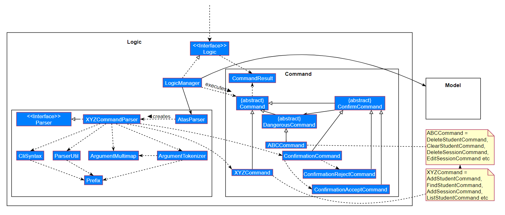

  <b>Figure 3.1.2</b>: Logic class diagram  
 

**How the architecture components interact with each other**

The *Sequence Diagram* below shows how the components interact with each other for the scenario where the user issues the command `addses s/Tutorial 1 d/10/10/2020`.

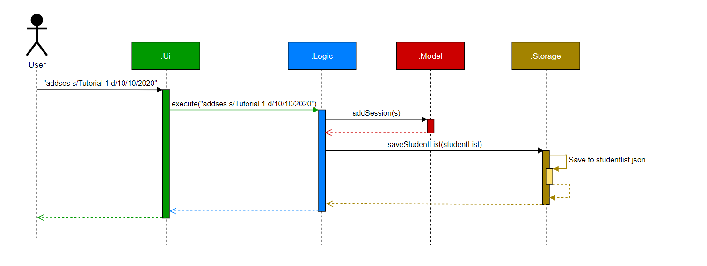

  <b>Figure 3.1.3</b>: Architecture sequence diagram  
 

The sections below give more details of each component.

{ end of `design#architecture` written by: Marcus Tan Wei }

{ start of `design#ui_component` written by: Ngoh Wei Yue }

### 3.2. UI component

  <b>Figure 3.2.1</b>: Class diagram of the Ui component  
 

**API** :
[`Ui.java`](https://github.com/AY2021S1-CS2103T-W16-4/tp/blob/master/src/main/java/atas/ui/Ui.java)

The UI consists of a `MainWindow` that is made up of parts e.g.`CommandBox`, `ResultDisplay`, `StudentListPanel`, `StatusBarFooterLeft` etc. All these, including the `MainWindow`, inherit from the abstract `UiPart` class except `Tab`.

The `UI` component uses JavaFx UI framework. The layout of these UI parts are defined in matching `.fxml` files that are in the `src/main/resources/view` folder. For example, the layout of the [`MainWindow`](https://github.com/AY2021S1-CS2103T-W16-4/tp/blob/master/src/main/java/atas/ui/MainWindow.java) is specified in [`MainWindow.fxml`](https://github.com/AY2021S1-CS2103T-W16-4/tp/blob/master/src/main/resources/view/MainWindow.fxml).

The `UI` component,

* Executes user commands using the `Logic` component.
* Listens for changes to `Model` data so that the UI can be updated with the modified data.
* Displays results to user if any.

{ end of `design#ui_component` written by: Ngoh Wei Yue }

{ start of `design#logic_component` written by: Alvin Chee Teck Weng }

### 3.3. Logic component

**API** :
[`Logic.java`](https://github.com/AY2021S1-CS2103T-W16-4/tp/blob/master/src/main/java/atas/logic/Logic.java)

1. `Logic` uses the `AtasParser` class to parse the user command.
1. This results in a `Command` object which is executed by the `LogicManager`.
1. The command execution can affect the `Model` (e.g. adding a student).
1. The result of the command execution is encapsulated as a `CommandResult` object which is passed back to the `Ui`.
1. In addition, the `CommandResult` object can also instruct the `Ui` to perform certain actions, such as displaying help to the user.

Given below is the Sequence Diagram for interactions within the `Logic` component for the `execute("enterses 1")` API call.

  <b>Figure 3.3.1</b>: Enter Session Sequence Diagram  

{ end of `design#logic_component` written by: Alvin Chee Teck Weng }

{ start of `design#model_component` written by: Masagca Eris Jacey }

### 3.4. Model component

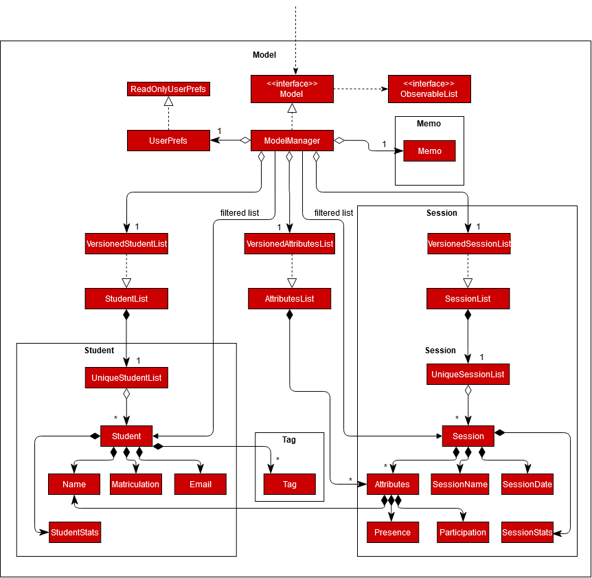

  <b>Figure 3.4.1</b>: Class diagram of the Model component  
 

**API** : [`Model.java`](https://github.com/AY2021S1-CS2103T-W16-4/tp/blob/master/src/main/java/atas/model/Model.java)

The `Model`,

* stores a `UserPref` object that represents the user’s preferences.
* stores the data of the following:
   * student list in a `StudentList` object
   * session list in a `SessionList` object
   * memo in a `Memo` object.
* exposes an unmodifiable `ObservableList<Student>` and `ObservableList<Session>` that can be 'observed'. e.g. For each list, the UI can be bound to the list so that the UI automatically updates when the data in the list change.
* does not depend on any of the other three components.

{ end of `design#model_component` written by: Masagca Eris Jacey }

{ start of `design#storage_component` written by: Zhang Sheng Yang }

### 3.5. Storage component

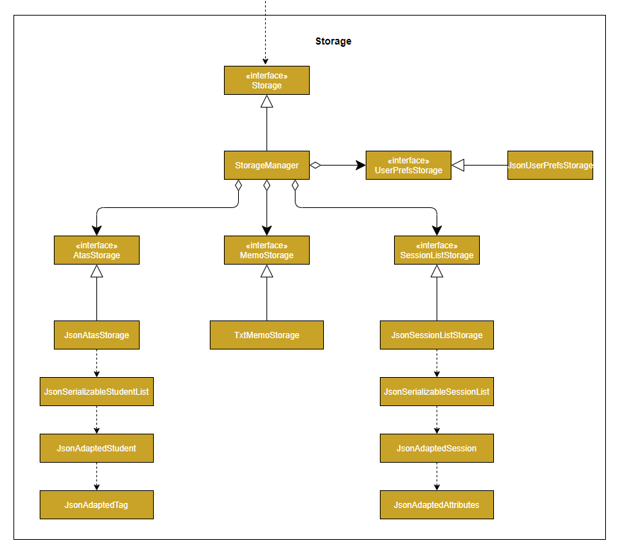

  <b>Figure 3.5.1</b>: Storage  
 

**API** : [`Storage.java`](https://github.com/AY2021S1-CS2103T-W16-4/tp/blob/master/src/main/java/atas/storage/Storage.java)

The `Storage` component,
* can save `UserPref` objects in json format and read it back.
* can save the student list data in json format and read it back.
* can save the session list data in json format and read it back.
* can save the memo data in txt file and read it back.

{ end of `design#storage_component` written by: Zhang Sheng Yang }

{ start of `design#common_classes` written by: Zhang Sheng Yang }

### 3.6. Common classes

Classes used by multiple components are in the `atas.commons` package.

{ end of `design#common_classes` written by: Zhang Sheng Yang }

--------------------------------------------------------------------------------------------------------------------

## 4. Implementation

This section describes some noteworthy details on how certain features are implemented.

{ start of `implementation#switch_between_tabs` written by: Ngoh Wei Yue }

### 4.1. Switching between different tabs

The switching of tabs is facilitated by `SwitchCommand`, `LogicManager`, `MainWindow` and `Tab`. `Tab` is an enum class that represents the various tabs that exist in ATAS.

Given below is an example usage scenario and how the switch mechanism behaves at each step.

Step 1. The user launches the application for the first time. The default "Students" tab is displayed.

Step 2. The user executes `switch sessions` command to view the sessions tab. `MainWindow#executeCommand()` is called and `LogicManager` calls `AtasParser#parseCommand()`. This results in the creation of a `SwitchCommandParser` to parse the user input.

Step 3. `SwitchCommandParser#parse()` checks if there is an argument being passed by the user. If an argument is passed, a `SwitchCommand` will be created and `SwitchCommand#execute()` will be called by the `LogicManager`.

:information_source: **Note:** If no argument is found, a `ParseException` will be thrown and the execution terminates.

 

Step 4. `SwitchCommand#execute()` will check if the argument passed in is an existing tab name. If the argument is valid, a `CommandResult` containing a variable `switchTab` with the value of the target `Tab` will be return to `MainWindow`.

:information_source: **Note:** If the argument is not a valid tab name, a `CommandException` will be thrown and the execution terminates.

 

Step 5. `MainWindow#handleSwitchTab()` will then be called and will check if the current `Tab` is the same as the target `Tab` to switched to. If it is not the same, `MainWindow` will utilise `tabPane` to execute the switch, thus updating the screen for the user.

:information_source: **Note:** If the current `Tab` is the same as the target `Tab`, a `CommandException` will be thrown and the execution terminates.

 

The following sequence diagram shows how the switch operation works:

  <b>Figure 4.1.1</b>: Sequence diagram showing how `Ui` component works with the `Logic` component to switch tabs  
 

The following activity diagram summarizes what happens when a user executes a switch command:

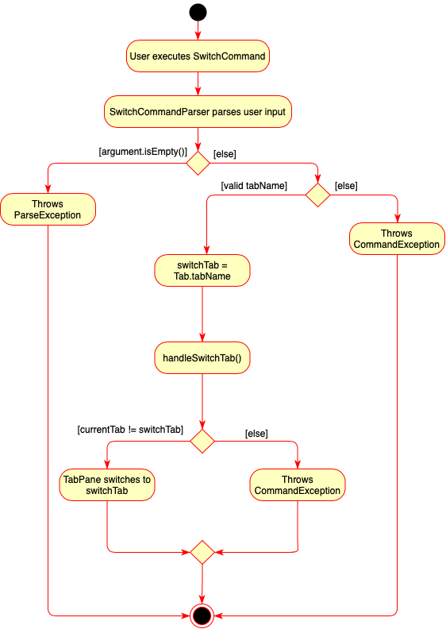

  <b>Figure 4.1.2</b>: Activity diagram showing the implementation of switching between tabs  
 

#### 4.1.1. Design consideration

* `Tab` is being implemented as an enum class because there is a fixed set of tabs that are available to be switched to. This prevents invalid values to be assigned to `Tab`.

{ end of `implementation#switch_between_tabs` written by: Ngoh Wei Yue }

{ start of `implementation#user_confirmation` written by: Marcus Tan Wei }

### 4.2. User confirmation

This feature (henceforth referred to as 'user confirmation') is facilitated by 'ConfirmCommand', 'DangerousCommand', 'Logic', and 'Model'.

There are 6 DangerousCommand(s) that will change the existing local data upon execution, namely:
1. deletestu (deleting a student)
2. editstu (editing the particulars of a student)
3. clearstu (clearing the student list)
4. deleteses (deleting a sesion)
5. editses (editing the information of a session)
6. clearses (clearing the session list)

`DangerousCommand` implements the method:

* `DangerousCommand#execute(Model)` - Returns a `CommandResult` of the `DangerousCommand`.

`ConfirmationCommand` implements the method:

* `ConfirmationCommand#execute(Model)` - Returns a `CommandResult` containing a user confirmation prompt to confirm the execution of the `DangerousCommand`.

'ConfirmationAcceptCommand' implements the method:

* `ConfirmationAcceptCommand#execute(Model)` - Executes the `DangerousCommand` and returns a `CommandResult` from `DangerousCommand#execute(Model)`.

`ConfirmationRejectCommand` implements the method:

* `ConfirmationRejectCommand#execute(Model)` - Returns a `CommandResult` indicating the `DangerousCommand` is not executed.

Given below is an example usage scenario and how the user confirmation prompt feature behaves at each step.

Step 1. The user launches the application with all his/her students already added to the student list. The `ModelManager` should already contain the list of students assigned to the user.

Step 2. The user executes a dangerous command, for example `deletestu 1`, to delete the first student in the student list. A `DeleteStudentCommandParser` is created by `LogicManager`.
If the input delete command is valid, a `DeleteStudentCommand` will be created by `DeleteStudentCommandParser#parse()` and passed into a `ConfirmationCommand` as a `DangerousCommand`.

Step 3. The `ConfirmationCommand` is executed, and the `ResultDisplay` window shows a confirmation prompt `Delete 1? (yes/no)`, where the user needs to input a `yes` or `no` to confirm or reject the execution of the `DangerousCommand` respectively.

Step 4. If the confirmation input is valid, a `ConfirmationCommandParser` is created by the `LogicManager` and either a `ConfirmationAcceptCommand` or `ConfirmationRejectCommand` is returned by `ConfirmationCommandParser#parser()`.

Step 5. The `ConfirmationAcceptCommand` or `ConfirmationRejectCommand` is then executed in `LogicManager#execute(String)` and a `CommandResult` is returned, which is displayed on `ResultDisplay`.

The following sequence diagram shows how the user confirmation feature works:

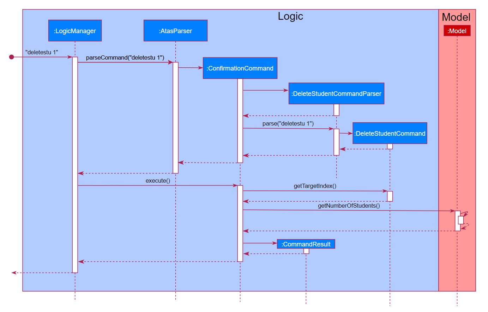

  <b>Figure 4.2.1</b>: User confirmation sequence part 1  
 

  <b>Figure 4.2.2</b>: User confirmation sequence part 2  
 

The following activity diagram summarizes what happens when a user executes a dangerous command (for eg. `DeleteStudentCommand`).

  <b>Figure 4.2.3</b>: Activity diagram for delete student 
 

{ end of `implementation#user_confirmation` written by: Marcus Tan Wei }

{ start of `implementation#adding_a_session` written by: Zhang Sheng Yang }

### 4.3. Adding a session

Adding a session to a class requires user input from the CLI. 
The parser will parse the user input to obtain the name and the date of the session. The newly added
session will also be filled with students' default presence and participation.

The below example given assumes that the user inputs `addses s/Tutorial 1 d/1/1/2020`, which 'Tutorial 1' and
'1/1/2020' are the name and the date of the session to be added, and `addses` command has already been parsed.

Step 1: Parse input and create session

An `AddSessionCommandParser` is created by `LogicManager` and calls `AddSessionCommandParser#parse()` with the given
user input. Input is parsed according to the prefix `s/` and `d/` to identify the parts of the
user input and split it into `String` slices. If both the name and date are present in the input,
those `String` will be used to create a `SessionName` and a `SessionDate` object, which will be used to
create and initialize a `Session` object. The `Session` object created will be the one being added to
the current session list later.

`AddSessionCommandParser#parse()` returns a `AddSessionCommand` object that contains the session object
 back to the `LogicManager`.

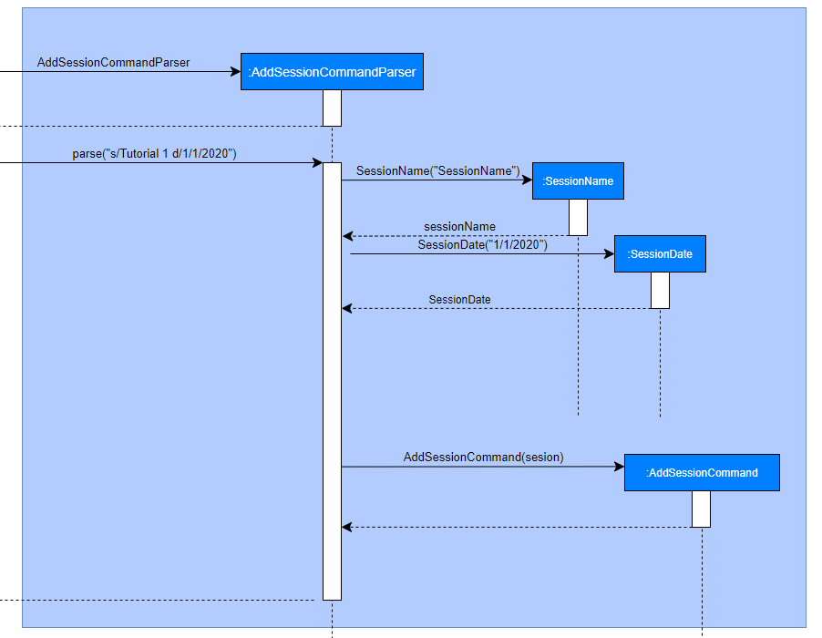

  <b>Figure 4.3.1</b>: Add Session Sequence Diagram 1  
 

Step 2: Add session to the model/session list

`LogicManager` calls `AddSessionCommand#execute()` to proceed on to adding the session to the model.
The `AddSessionCommand` will first check if the same session is already in the session list, if the
session exists in the current session list, then the session will not be added to the session list.

Assuming that the session to add is not a session already in the list, `ModelManager` will update
the internal student list of the session list, then it uses addSession method to add the session to the
list.

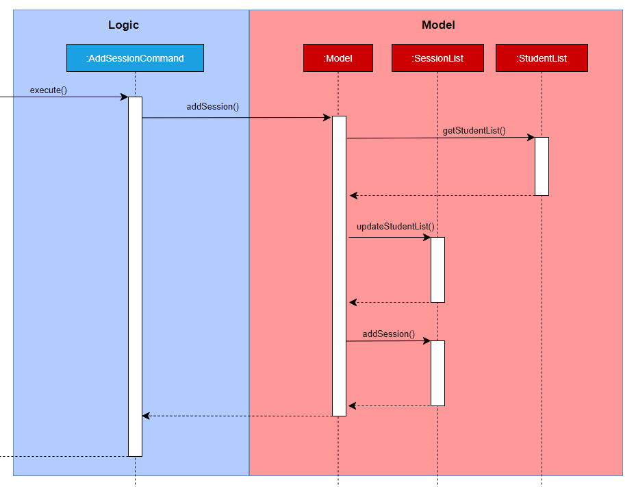

  <b>Figure 4.3.2</b>: Add Session Sequence Diagram 2  
 

The following activity diagram summarizes what happens when a user executes an `addses` command:

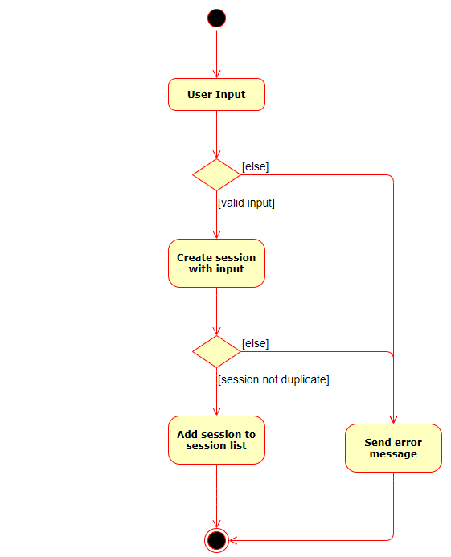

  <b>Figure 4.3.3</b>: Add Session Activity Diagram  
 

{ end of `implementation#adding_a_session` written by: Zhang Sheng Yang }

{ start of `implementation#entering_a_session` written by: Alvin Chee Teck Weng }

### 4.4. Entering a session

This feature (henceforth referred to as 'enter session') is facilitated by `EnterSessionCommand`, `LogicManager` and `Model`.

`LogicManager` implements the method:

* `LogicManager#execute(Model)` — Returns a `CommandResult` containing the session index of the session.

`EnterSessionCommand` implements the method from `LogicManager`:

* `EnterSessionCommand#execute(Model)` — Returns a `CommandResult` containing the session index of the session.

`Model` implements the method:

* `Model#enterSession(Index)` — Enters a session based on session index.

Given below is an example usage scenario and how the enter session mechanism behaves at each step.

Step 1. The user launches the application with all his/her students already added to the student list. The `ModelManager` should already contain the list of students assigned to the user.

Step 2. The user executes `enterses 1` to enter session 1. The `enterses 1` command calls `LogicManager#execute()`.

Step 3. `EnterSessionCommandParser#parse()` checks if there argument passed is valid. If the argument is valid, a `EnterSessionCommand` will be created and `EnterSessionCommand#execute()` will be called by the `LogicManager`.

:information_source: **Note:** If an invalid argument is found, a `ParseException` will be thrown and the execution terminates.

 

Step 4. `Model#enterSession()` will be called by `EnterSession#execute()` and the displayed tab will be switched to Current Session. Details of session 2 will be displayed to the user.

The following sequence diagram shows how the enter session operation works:

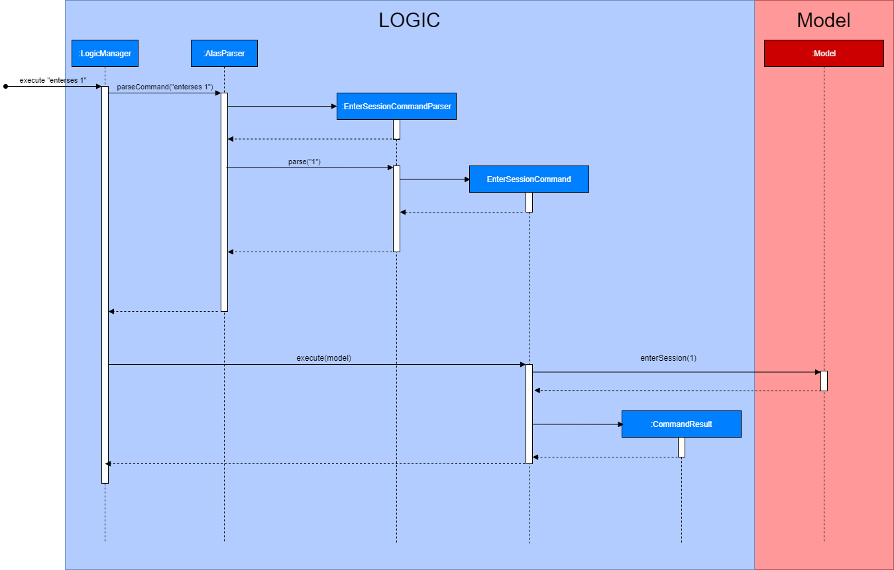

  <b>Figure 4.4.1</b>: Enter Session Sequence Diagram  

The following activity diagram summarizes what happens when a user executes an enter session command:

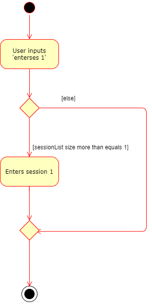

  <b>Figure 4.4.2</b>: Enter Session Activity Diagram  

{ end of `implementation#entering_a_session` written by: Alvin Chee Teck Weng }

{ start of `implementation#presence_and_participation` written by: Zhang Sheng Yang }

### 4.5. Presence and participation

Below only shows the flow of `participate` command since `presence` command works the same way.

Toggling the presence and participation status of students requires CLI input.
The parser will parse the user input to obtain an index range in order to toggle students in that range. 
The toggled presence or participation will change in color(either green or red) and statistics will be affected.

The below example given assumes that the user inputs `participate 1-4`, which '1-4' is the index range
, and `participate` command has already been parsed.

Step 1: Parse input

An `ParticipateCommandParser` is created by `LogicManager` and calls `ParticipateCommandParser#parse()` 
with the given user input. Input is parsed according as a preamble to identify the parts of the
user input and split it into `String` slices. If the input index range is valid, checked by validation method in 
`IndexRange` class itself, a `IndexRange` object will be created and initialized with the a default session name as 
a placeholder. The `ParticipateCommand` object created will be passed back to `LogicManager` to execute.

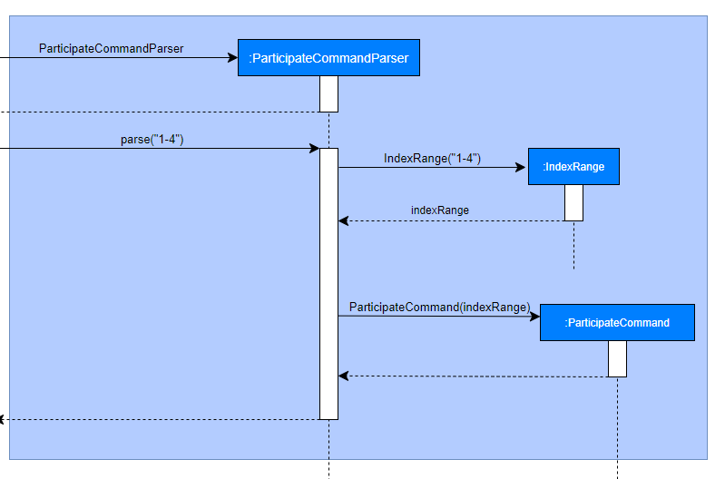

  <b>Figure 4.5.1</b>: Participate Sequence Diagram 1  
 

Step 2: Toggling participation

`LogicManager` calls `ParticipateCommand#execute()` to proceed on to toggling the participation status of students in 
the student list in this current session.
The `ParticipateCommand` will first check if we have entered a session, if `model#returnCurrentSessionEnabledStatus()` 
return false, then an exception will be thrown to signal that we are currently not in a session.

Assuming that we are in a session, `ModelManager#updateParticipationBySessionName()` will be called. The session 
name of the current session is obtained and passed as a parameter together with index range during the invocation 
of `SessionList#updateStudentPresence()`. Session list will now search through the list of sessions for a match, 
when a matching session is found, `Session#updatePresence()` is called to toggle the participation status of students 
according to the index range. 

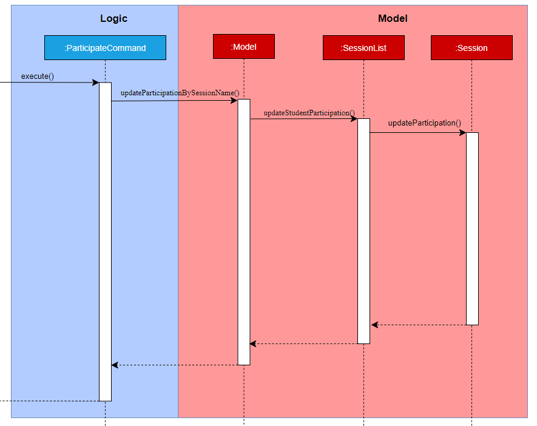

  <b>Figure 4.5.2</b>: Participate Sequence Diagram 2  
 

The following activity diagram summarizes what happens when a user executes an `participate` command:

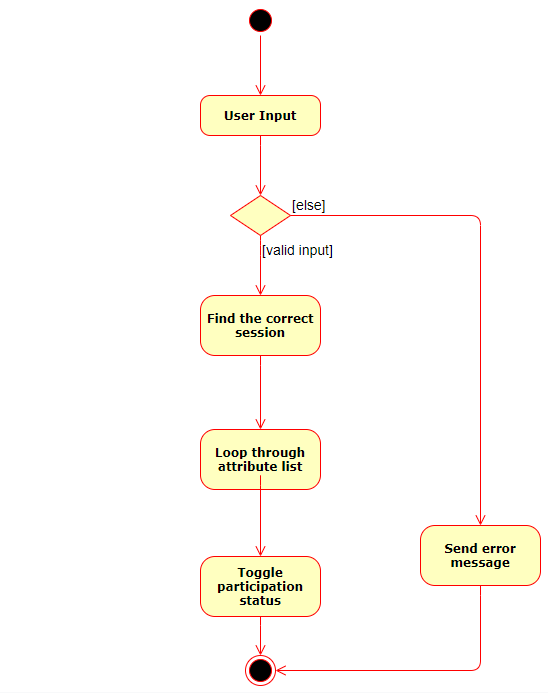

  <b>Figure 4.5.3</b>: Participate Activity Diagram  
 

{ end of `implementation#presence_and_participation` written by: Zhang Sheng Yang }

{ start of `implementation#random_name_generation` written by: Masagca Eris Jacey }

### 4.6. Generating the name of a randomly-selected student

This feature (henceforth referred to as 'RNG') is facilitated by `RngCommand` and `RandomGenerator`.

`RngCommand` implements the method:

* `RngCommand#execute(Model)` — Returns a `CommandResult` containing the name of a randomly-selected student.

`RandomGenerator` implements the method:

* `RandomGenerator#getNextInt(int)` — Returns the index of the next randomly-generated student.

The `RandomGenerator` is contained in `Model`. It implements the method:

* `ModelManager#generateRandomStudentIndex()` — Returns the index of a randomly-generated student in the student list.

The operation above is exposed in the `Model` interface as `Model#generateRandomStudentIndex()`.

Given below is an example usage scenario and how the RNG mechanism behaves at each step.

Step 1. The user launches the application with all his/her students already added to the student list. The `ModelManager` should already contain the list of students assigned to the user.

Step 2. The user executes `rng` to pick a random student in his/her student list. The `rng` command calls `Model#generateRandomStudentIndex()`, which in turn calls `RandomGenerator#getNextInt(int)`.

Step 3. The `Index` returned during the execution of `RngCommand#execute(Model)` is used to fetch the name of the corresponding student (in the student list) to be selected. The student's name is then displayed to the user.

The following sequence diagram shows how the RNG operation works:

  <b>Figure 4.6.1</b>: A sequence diagram showing the implementation of the `rng` command  
 

The following activity diagram summarizes what happens when a user executes an RNG command:

  <b>Figure 4.6.2</b>: An activity diagram showing the series of events upon the user entering an `rng` command  

{ end of `implementation#random_name_generation` written by: Masagca Eris Jacey }

{ start of `implementation#undo_redo` written by: Masagca Eris Jacey }

### 4.7. Undo/redo feature

The undo/redo mechanism is facilitated by `ModelManager`. 
It contains the following entities:
* `VersionedStudentList`
* `VersionedSessionList`
* `VersionedAttributesList` 

Each versioned entity extends its corresponding non-versioned class (e.g. `VersionedStudentList` extends from `StudentList`)
with an undo/redo history, stored internally as an `<<entity>>StateList` and `currentStatePointer`.
Additionally, each entity implements the following operations:

* `Versioned<<Entity>>List#commit()` — Saves the current entity state in its history.
* `Versioned<<Entity>>List#undo()` — Restores the previous entity state from its history.
* `Versioned<<Entity>>List#redo()` — Restores a previously undone entity state from its history.

The operations above are called in `ModelManager` under their respective methods within the class:
* `ModelManager#commit()`
* `ModelManager#undo()`
* `ModelManager#redo()` 

These operations are exposed in the `Model` interface as `Model#commit()`, `Model#undo()` and `Model#redo()` respectively.

:information_source: **Note:** Whenever a command that commits is made, `Model#commit()` is called, which means that
 all 3 of `<<Versioned<<Entity>>List>>#commit()` will be called. 
 A similar mechanism occurs for `Model#undo()` and `Model#redo()`.  

Given below is an example usage scenario and how the undo/redo mechanism behaves at each step.

Step 1. The user launches the application for the first time. Each `Versioned<<Entity>>` will be initialized with the initial entity state, and the `currentStatePointer` pointing to that single entity state.

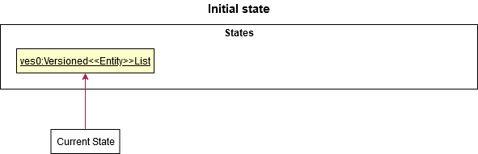

  <b>Figure 4.7.1</b>: Each versioned entity state upon initialization  
 

Step 2. The user executes `deletestu 5` command to delete the 5th student in the student list. 
The `deletestu` command calls `Model#commit()`, causing the modified state of all versioned entities after the `deletestu 5` command executes to be saved in the `<<entity>>StateList`,
 and the `currentStatePointer` for each `Versioned<<Entity>>List>>` is shifted to the newly inserted entity state.

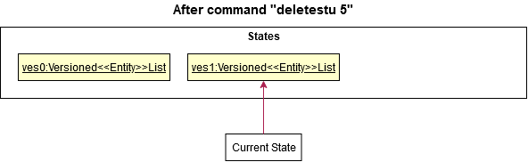

  <b>Figure 4.7.2</b>: Each versioned entity state upon executing the `deletestu` command  
 

Step 3. The user executes `addstu n/David …​` to add a new student. The `addstu` command also calls `Model#commit()`, causing another modified address entity state (for each state) to be saved into the `<<entity>>StateList`.

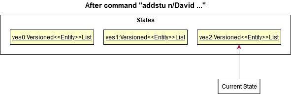

  <b>Figure 4.7.3</b>: Each versioned entity state upon executing the `addstu` command  
 

:information_source: **Note:** If a command fails its execution, it will not call `Model#commit()`, so any entity state will not be saved into the `<<entity>>StateList`.

Step 4. The user now decides that adding the student was a mistake, and decides to undo that action by executing the `undo` command.
The `undo` command will call `Model#undo()`, which will shift the `currentStatePointer` for *all* versioned entities once to the left, pointing it to the previous entity state, and restores each entity to that state.

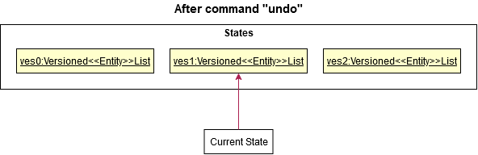

  <b>Figure 4.7.4</b>: Each versioned entity state upon executing a single `undo` command  
 

:information_source: **Note:** If the `currentStatePointer` is at index 0, pointing to the initial entity state, then there are no previous entity states to restore. 
The `undo` command uses `Model#canUndo()` to check if this is the case. 
If so, it will return an error to the user rather than attempting to perform the undo.

The following sequence diagram shows how the undo operation works:

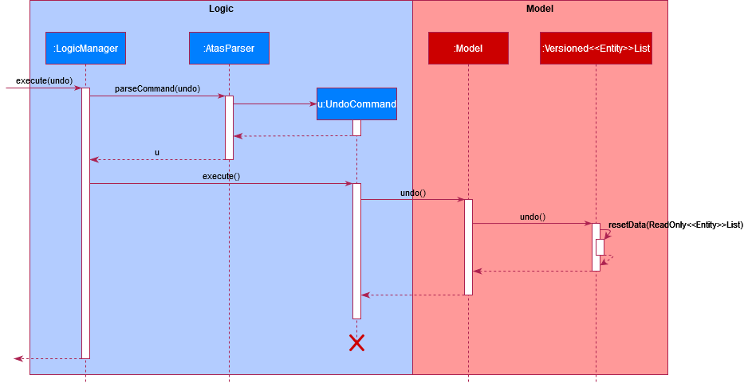

  <b>Figure 4.7.5</b>: A sequence diagram showing the implementation of the `undo` operation  
 

The `redo` command does the opposite — it calls `Model#redo()`, which shifts the `currentStatePointer` for each versioned entity once to the right, pointing to the previously undone state, and restores each entity to that state.

:information_source: **Note:** If the `currentStatePointer` is at index `<<entity>>StateList.size() - 1`, pointing to the latest entity state, then there are no undone entity states to restore. 
The `redo` command uses `Model#canRedo()` to check if this is the case. If so, it will return an error to the user rather than attempting to perform the redo.

Step 5. The user then decides to execute the command `liststu`. Commands that do not modify any entity, such as `liststu`, will usually not call `Model#commit()`, `Model#undo()` or `Model#redo()`. 
Thus, the `<<entity>>StateList` for each versioned entity remains unchanged.

  <b>Figure 4.7.6</b>: Each versioned entity state upon executing the `liststu` command  
 

Step 6. The user executes `clearstu`, which calls `Model#commit()`. 
Since the `currentStatePointer` for each versioned entity is not pointing at the end of the `<<entity>>StateList`, all entity states after the `currentStatePointer` will be purged. 
Reason: It no longer makes sense to redo the `addstu n/David …​` command. This is the behavior that most modern desktop applications follow.

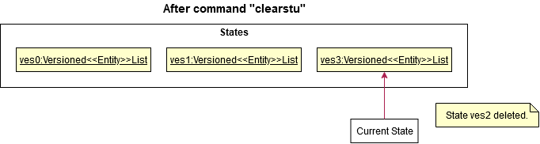

  <b>Figure 4.7.7</b>: Each versioned entity state upon executing the `clearstu` command  
 

The following activity diagram summarizes what happens when a user executes a new command:

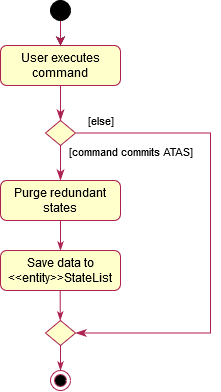

  <b>Figure 4.7.8</b>: An activity diagram showing the series of events upon a user executing a command  
 

#### 4.7.1. Design consideration

**Aspect: how undo & redo execute**

* **Alternative 1 (current choice):** For each versioned entity, saves the entire entity.
   * Pros: Easy to implement.
   * Cons: May have performance issues in terms of memory usage.

* **Alternative 2:** Individual command knows how to undo/redo by itself.
   * Pros: Will use less memory (e.g. for `deletestu`, just save the student being deleted).
   * Cons: We must ensure that the implementation of each individual command are correct.

**Aspect: data structure to store the different entity states**

* **Alternative 1 (current choice):** List
   * Pros: Very straightforward.
   * Cons: May have performance issues in terms of runtime (linear).
   
* **Alternative 2:** Search tree
   * Pros: Much more time-efficient than a list due to logarithmic time complexity for most its functions (search, add, etc.)
   * Harder to implement.

{ end of `implementation#undo_redo` written by: Masagca Eris Jacey }

{ start of `implementation#adding-a-note` written by: Ngoh Wei Yue }

### 4.8. Adding a note

**Adding a note** is facilitated by `AddNoteCommand`, `Memo`, `TxtMemoStorage` and `MemoBox`.

This implementation of this feature can be split into 3 main parts:
1. Updating the content in `Memo`.
2. Updating the data in the hard disk.
3. Updating the content in `MemoBox` to be displayed to the user.

`AddNoteCommand` implements the method:

* `AddNoteCommand#execute(Model)` — Calls `Model#addNoteCommand()` and returns a `CommandResult` which notifies the `Ui` component to edit the content in the `MemoBox`.

`Memo` is contained in `Model`. It implements the method:

* `Memo#addNote()` — Appends the note to the current content and sets the new content to be the new content of `Memo`.

`MemoStorage` implements `MemoStorage` which is contained in `Storage`. It implements the method:

* `TxtMemoStorage#saveMemo()` — Writes the content in `Memo` to the hard disk.

`MemoBox` implements the method:
* `Memo#setTextContent()` — Sets text into a text box contained on `MemoBox` to be displayed to the user.

Given below is an example usage scenario and how adding a note behaves at each step.

Step 1. The user executes `addnote note` to add the word "note" onto a new line in the memo box.

Step 2. An `AddNoteCommand` is created, and the `AddNoteCommand#execute()` is called which in turn calls `Model#addNoteToMemo()`.

Step 3. `ModelManager#addNoteToMemo()` calls `Memo#addNote()` which concatenates "note" to the end of the original content and sets it to be the new content.

The following sequence diagram shows how adding a note updates the content in `Memo`:

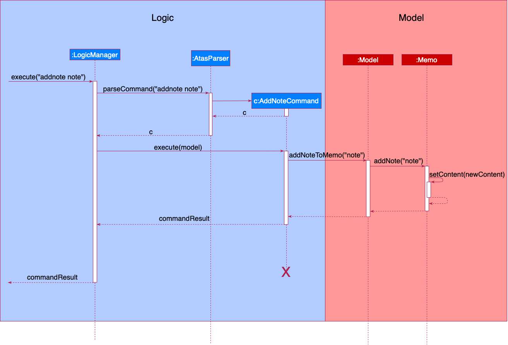

  <b>Figure 4.8.1</b>: Sequence diagram showing how the `Logic` component updates the content in `Memo`  
 

Step 4: After the content in `Memo` is updated, `Storage#saveMemo()` is called.

Step 5: `StorageManager#saveMemo()` calls `TxtMemoStorage#saveMemo()` which retrieves the updated content in `Memo` and writes in to a hard disk, following a specified file path.

The following sequence diagram shows how adding a note updates the data in the hard disk:

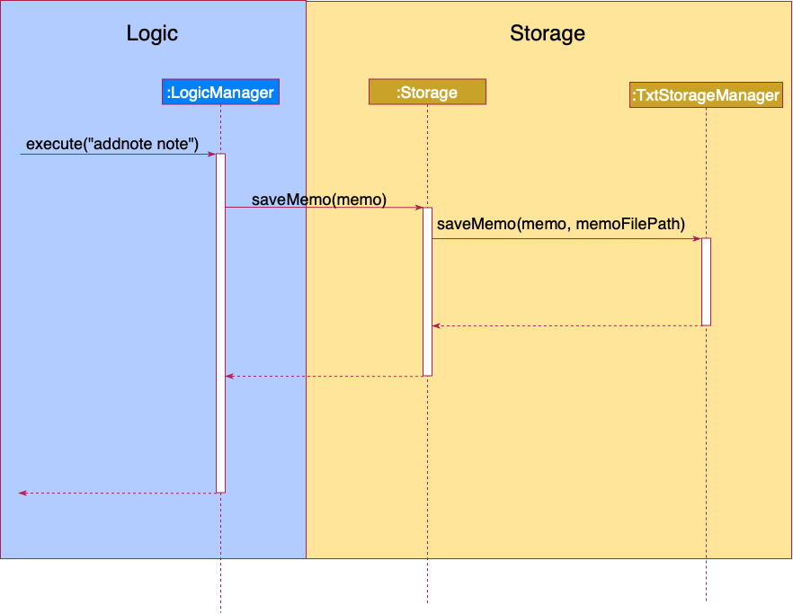 

  <b>Figure 4.8.2</b>: Sequence diagram showing how the `Logic` component updates the memo data in the hard disk  
 

Step 5: A `CommandResult` returned from `AddNoteCommand#execute()` is returned to `MainWindow#executeCommand()`. Since the boolean value `isEditMemo` contained in the `CommandResult` is true, `MainWindow#handleEditMemo()` is called.

Step 6: `MainWindow#handleEditMemo()` retrieves the updated `Memo` content using `Logic#getMemoContent()` and calls `MemoBox#setTextContent()` to sets the updated content into the text box contained in `MemoBox`.

The following sequence diagram shows how adding a note updates the text box of `MemoBox` to be displayed to user:

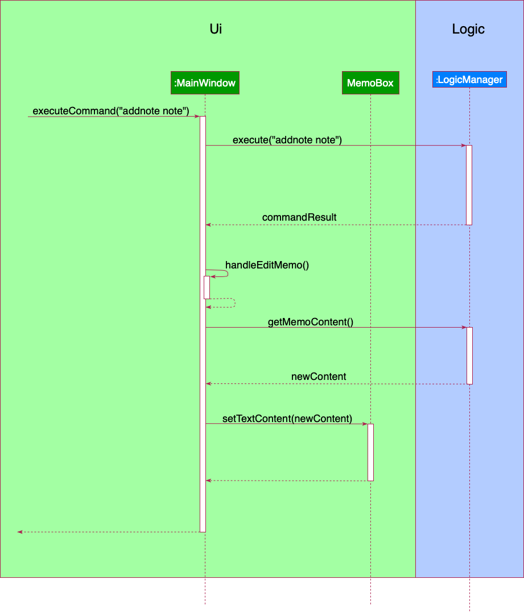 

  <b>Figure 4.8/3</b>: Sequence diagram showing how the `Ui` component works with the `Logic` component to update the GUI  
 

{ end of `implementation#adding_a_note` written by: Ngoh Wei Yue }

{ start of `implementation#exporting_data` written by: Alvin Chee Teck Weng }

### 4.9. [Proposed] Exporting data to csv

A data exporting feature to csv can be implemented in the future.

Pros: Data are now more organised can be opened by apps such as Microsoft Excel.

Cons: Not easy to implement because it requires the knowledge of how to organise the data into csv format.

{ end of `implementation#exporting_data` written by: Alvin Chee Teck Weng }

{ start of `implementation#data_encryption` written by: Marcus Tan Wei }

### 4.10 [Proposed] Data encryption
Data encryption can be implemented in the future versions. This is to further protect the students' particulars. 

#### 4.10.1 Solution 1
Encrypt and store data locally.

* Pros: 
   * Easy to implement. One example is through the usage of Java Cryptography API.

* Cons: 
   * Performance reduction may occur since every call to save to storage requires encrypting a lot of data.
   * Security issues may still arise if we store the encryption key in the same machine.

#### 4.10.2 Solution 2
Store data outside the user’s machine and issue the user an access token.

* Pros: 
   * Data will be bounded to multiple machines, hence, can be restored if the user forgets his or her credentials.

* Cons: 
   * There will be generation of access tokens and checking them.
   * Require changes to the current implementation to work with external storage.

{ end of `implementation#dat_encryption` written by: Marcus Tan Wei }

--------------------------------------------------------------------------------------------------------------------

{ start of `documentation` written by: Ngoh Wei Yue }

## 5. Documentation

Refer to this guide [here](Documentation.md).

{ end of `documentation` written by: Ngoh Wei Yue }

{ start of `logging` written by: Marcus Tan Wei }

## 6. Logging

Refer to this guide [here](Logging.md).

{ end of `logging` written by: Marcus Tan Wei }

--------------------------------------------------------------------------------------------------------------------

{ start of `testing` written by: Alvin Chee Teck Weng }

## 7. Testing

Refer to this guide [here](Testing.md).

{ end of `testing` written by: Alvin Chee Teck Weng }

--------------------------------------------------------------------------------------------------------------------

{ start of `configuration` written by: Zhang Sheng Yang }

## 8. Configuration

Refer to this guide [here](Configuration.md).

{ end of `configuration` written by: Zhang Sheng Yang }

--------------------------------------------------------------------------------------------------------------------

{ start of `devops` written by: Masagca Eris Jacey }

## 9. DevOps

Refer to this guide [here](DevOps.md).

{ end of `devops` written by: Masagca Eris Jacey }

--------------------------------------------------------------------------------------------------------------------

## 10. Appendix: requirements

{ start of `requirements#product_scope` written by: Masagca Eris Jacey }

### 10.1. Product scope

**Target user profile**:

* Bob is a passionate CS1010 TA and he likes to track his students’ progress.
* Bob currently uses Excel to keep track of his student’s particulars.
* Bob finds the features on Excel clunky at times and he finds them difficult to learn.
* Bob is looking for an application with a sleeker and cleaner UI so he doesn’t have to remember where the different features in Excel are.
* Bob has limited memory in his computer and wants to install smaller softwares.
* Bob is looking for an application that specifically enhances in-class management efficiency.
* Bob is a fast typist.
* Bob hates to move his mouse at all (to save file, to categorise data fields and student data)
* Bob uses a laptop and doesn’t have a mouse with him all the time(or he doesn’t have a place to use his mouse when on the bus or mrt).

**Value proposition**:

* Manage students faster than a typical mouse/GUI driven app
* Sleeker and cleaner UI, less clunky
* Less memory
* Intuitive command-line interface - easy to learn and pick up, especially for technologically savvy individuals
* CS student-friendly
* Current features:
   * Manage students' particulars (name, matriculation number, email, additional tag(s))
   * Manage sessions' particulars (name, date)
   * Track students' progress for each session (attendance/presence, participation)
   * Random name generation to easily randomly select a student
   * Memo box for user to note down sticky notes in a pinch
* Potential features (in future iterations):
   * Mass sending of emails/files
   * Import/export data files from Excel, csv files
   * Track student’s progress (assignments, tests)
   * Record student’s attendance
   * Profile pictures for recognisability
   * Schedule consultations/Zoom meeting
   * Automate formation of Telegram groups

{ end of `requirements#product_scope` written by: Masagca Eris Jacey }

{ start of `requirements#user_stories` written by: Alvin Chee Teck Weng }

### 10.2. User stories

Priorities: High (must have) - `* * *`, Medium (nice to have) - `* *`, Low (unlikely to have) - `*`

| Priority | As a …​                                    | I want to …​                   | So that I can…​                                                         |
| -------- | ------------------------------------------ | ------------------------------ | ----------------------------------------------------------------------- |
| `* * *`  | user                                       | see usage instructions         | refer to instructions when I forget how to use the App                  |
| `* * *`  | tutor                                       | add a new student              | add details of the students in my class                                |                     
| `* * *`  | tutor                                       | delete a student               | remove details of the students no longer taking the module             |                 
| `* * *`  | tutor                                       | find a student by name         | locate details of students without having to go through the entire list|
| `* * *`  | tutor with many students in my class        | sort students by name          | locate a student easily                                                |
| `* *  `  | tutor                                       | track my students' attendance  | take note of the tutorial participation for each student               |
| `* *  `  | tutor with limited class time | have a random number generator that generates a random number quickly | get a random student to answer my question more efficiently instead of having to rely on online generators |
| `* *  `  | tutor                                       | add non-registered Christian names or nicknames to my students | remember my students more easily       |
| `* *  `  | tutor who likes to do my administrative work on just one platform | send important emails to my students | not have to rely on external apps like Microsoft Outlook/LumiNUS |
| `* *  `  | tutor                                       | have diagrams tracking students' progress | pick out easily which student is not catching up with lecture material |
| `* *  `  | tutor who can be quite forgetful           | create a list of announcements | remember to convey them to my students                                  |
| `* *  `  | tutor who wants to protect the particulars of my students | encrypt files with passwords | keep the module and students' data safe                    |
| `* *  `  | tutor who often overshoots the time allocated for my lesson | be reminded at certain intervals | be on track throughout the lesson                    |
| `* *  `  | tutor who wants the class to participate actively in class discussions | quickly record who has spoken | call on those who haven't spoken for subsequent questions |
| `*    `  | user who likes customization               | customize my own keyboard shortcuts |                                                                    |
| `*    `  | user who likes colors                      | customize the UI to whatever color scheme I want | enjoy using the App more                              |

{ end of `requirements#user_stories` written by: Alvin Chee Teck Weng }

{ start of `requirements#use_cases` written by: Zhang Sheng Yang }

### 10.3. Use cases

(For all use cases below, the **System** is the `ATAS` and the **Actor** is the `user`, unless specified otherwise)

**Use case: UC01 - Add a student**

**Guarantees :**
* Student will be added only if the input name, Matriculation number, NUS email and tags are valid.
* The student list will not have duplicate students.

**MSS**

1. User requests to add a student with specified Matriculation number and NUS email, as well as any additional tags (if any).
1. ATAS checks if the input is valid and scans through the student list for duplication.
1. ATAS adds the student.

Use case ends.

**Extensions**

* 2a. A student in the list has the same Matriculation number.
   * 2b1. ATAS shows an error message.
   
   Use case ends.

* 2b. Matriculation number provided is invalid.
  * 2b1. ATAS shows an error message.
  
  Use case ends.
  
* 2c. A student in the list has the same NUS email.
  * 2c1. ATAS shows an error message.
  
  Use case ends.
  
* 2d. The email provided is not NUS email.
  * 2d1. ATAS shows an error message.
  
  Use case ends.
  

**Use case: UC02 - Delete a student**

**MSS**

1.  User requests to list students.
1.  ATAS shows a list of students.
1.  User requests to delete a specific student in the list.
1.  ATAS sends confirmation message.
1.  User confirms.
1.  ATAS deletes the student.

Use case ends.

**Extensions**

* 2a. The list is empty.

   Use case ends.

* 3a. The given index is invalid.
  * 3a1. ATAS shows an error message.
  
   Use case resumes at step 2.

* 4a. User denies confirmation

   Use case ends.
   

**Use case: UC03 - Edit a student**

**Guarantees :**
* Student will be edited only if the edited name, Matriculation number, NUS email and tags are valid.
* The student list will not have duplicate students after edit.

**MSS**

1.  User requests to edit a student with name, Matriculation number, NUS email and tags with the student index of that student.
1.  ATAS checks if the input is valid and scans through the student list for duplication.
1.  ATAS sends confirmation message.
1.  User confirms.
1.  ATAS edits the student.

   Use case ends.

**Extensions**

* 2a. A student in the list has the same Matriculation number.
   * 2b1. ATAS shows an error message.
   
   Use case ends.

* 2b. Matriculation number provided is invalid.
  * 2b1. ATAS shows an error message.
  
  Use case ends.
  
* 2c. A student in the list has the same NUS email.
  * 2c1. ATAS shows an error message.
  
  Use case ends.
  
* 2d. The email provided is not NUS email.
  * 2d1. ATAS shows an error message.
  
  Use case ends.
  
* 2e. The given student index is invalid.
  * 2e1. ATAS shows an error message.
  
  Use case ends.
  
* 3a. User denies confirmation.

  Use case ends.
  

**Use case: UC04 - Clear the student list**

**MSS**

1.  User requests to clear the student list.
1.  ATAS ask for confirmation.
1.  User confirms.
1.  ATAS clears the student list.

Use case ends.

**Extensions**

* 1a. The list is empty.
   Use case ends.

* 2a. User denies confirmation.

  Use case ends.

**Use case: UC05 - List the registered students**

**MSS**

1. User requests to see the list of students that have been added to ATAS.
1. ATAS shows the list of students.

Use case ends.

**Use case: UC06 - Find a student**

**MSS**

1.  User requests to find a student with one or more keywords.
1.  ATAS searches for students’ names that contain any of the keywords.
1.  ATAS shows the filtered list of students to User.

   Use case ends.

**Extensions**

* 2a. The list is empty.

   Use case ends.
   

**Use case: UC07 - Add a session**

**Guarantees :**
* Session will be added only if the input session name and session date are valid.
* The session list will not have duplicate sessions after adding.

**MSS**

1.  User requests to add a session with a session name and date.
1.  ATAS checks if the inputs are valid and scans though the session list for duplication.
1.  ATAS adds the session to the session list.
1.  ATAS sorts the session list according to date.

   Use case ends.

**Extensions**

* 2a. The given date is invalid.
  * 2a1. ATAS shows an error message.
  
  Use case ends.
  
* 2b. A session in the session list has the same session name.
  * 2b1. ATAS shows an error message.
  
  Use case ends.
  

**Use case: UC08 - Delete a session**

**MSS**

1.  User requests to delete a session with the given index.
1.  ATAS asks for confirmation.
1.  User confirms.
1.  ATAS deletes the session.

   Use case ends.

**Extensions**

* 1a. The given session index is invalid.
  * 1a1. ATAS shows an error message.
  
  Use case ends.

* 2a. User denies confirmation.

  Use case ends.
  

**Use case: UC09 - Edit a session**

**Guarantees :**
* Session will be edited only if the edited session name and session date are valid.
* The session list will not have duplicate sessions after edit.

**MSS**

1.  User requests to edit a session with session name and date with the session index of that session.
1.  ATAS checks if the input is valid and scans through the session list for duplication.
1.  ATAS asks for confirmation.
1.  User confirms.
1.  ATAS edits the session

   Use case ends.

**Extensions**

* 2a. The given session index is invalid
   * 2a1. ATAS shows an error message.
   
   Use case ends.

* 2b. The session date given is invalid
  * 2b1. ATAS shows an error message.
  
  Use case ends.

* 3a. User denies confirmation.

  Use case ends.

**Use case: UC10 - Clear the session list**

**MSS**

1.  User requests to clear the session list.
1.  ATAS asks for confirmation.
1.  User confirms.
1.  ATAS clears the session list.

   Use case ends.

**Extensions**

* 1a. The session list is empty
   * 1a1. ATAS shows an empty session list.
   
   Use case ends.
   
* 2a. User denies confirmation.

  Use case ends.
   

**Use case: UC11 - Enter a session**

**MSS**

1.  User requests to enter a session with a session index.
1.  ATAS shows the attributes of that session.

   Use case ends.

**Extensions**

* 1a. The session index is invalid.
   * 1a1. ATAS shows an error message.
   
   Use case ends.

* 1b. The session index is the same as current session.
   * 1b1. ATAS shows an error message.
   
   Use case ends.

**Use case: UC12 - Toggle presence**

**Preconditions : User has entered a session**

**MSS**

1.  User requests to toggle students' presence status of the given student index range.
1.  ATAS toggles the presence status of students.
1.  ATAS updates the statistics in session and student list.

   Use case ends.

**Extensions**

* 1a. The given index range is invalid.
   * 1a1. ATAS shows an error message.
   
   Use case ends.
   

**Use case: UC13 - Toggle participation**

**Preconditions : User has entered a session**

**MSS**

1.  User requests to toggle students' participation status of the given student index range.
1.  ATAS toggles the participation status of students.
1.  ATAS updates the statistics in session and student list.

   Use case ends.

**Extensions**

* 1a. The given index range is invalid.
   * 1a1. ATAS shows an error message.
   
   Use case ends.
   

**Use case: UC14 - Choose random name**

**MSS**

1.  User requests to choose a random name from the student list.
1.  ATAS shows the name of a random student in the student list.

   Use case ends.

**Extensions**

* 1a. The student list is empty
   * 1a1. ATAS shows an error message.
   
   Use case ends.
   

**Use case: UC15 - Exit ATAS**

**MSS**

1. User requests to exit ATAS
1. ATAS closes

Use case ends.

{ end of `requirements#use_cases` written by: Zhang Sheng Yang }

{ start of `requirements#non_functional_requirements` written by: Ngoh Wei Yue }

### 10.4. Non-functional requirements

1. This product should work on any _mainstream OS_ as long as it has Java `11` or above installed.
1. This product should be able to hold up to 500 students and 500 sessions without a noticeable sluggishness in performance for typical usage.
1. This product should be optimised for users who can type regular English text (i.e. not code, not system admin commands) fast and prefer typing over other means of input (e.g., mouse).
1. This product should be for a single user and should not be a multi-user product.
1. This product should not depend on remote servers.
1. This product should be able to function without being connected to a network.
1. This product should be able to work without requiring an installer.
1. Data generated by the product should be stored locally in human-editable file.
1. This product should not contain very large file sizes (JAR files - 100Mb, PDF files - 15Mb/file).

{ end of `requirements#non_functional_requirements` written by: Ngoh Wei Yue }

{ start of `requirements#glossary` written by: Marcus Tan Wei }

### 10.5. Glossary

* **Mainstream OS**: Windows, Linux, Unix, OS-X
* **Matriculation number**: A unique alphanumeric number attributed to each NUS student. Follows the format A0123456X, where each digit can be from 0-9 and the last letter can be any alphabet A-Z
* **Tag**: A word or phrase the user labels the student as.

{ end of `requirements#glossary` written by: Marcus Tan Wei }

--------------------------------------------------------------------------------------------------------------------

## 11. Appendix: instructions for manual testing

Given below are instructions to test the app manually.

:information_source: **Note:** These instructions only provide a starting point for testers to work on;
testers are expected to do more *exploratory* testing.

{ start of `manual_testing#launch_and_shutdown` written by: Masagca Eris Jacey }

### 11.1. Launch and shutdown

1. Initial launch

  1. Download the jar file and copy into an empty folder

  1. Double-click the jar file Expected: Shows the GUI with a set of sample students and sample sessions. 
  The window size may not be optimum.
  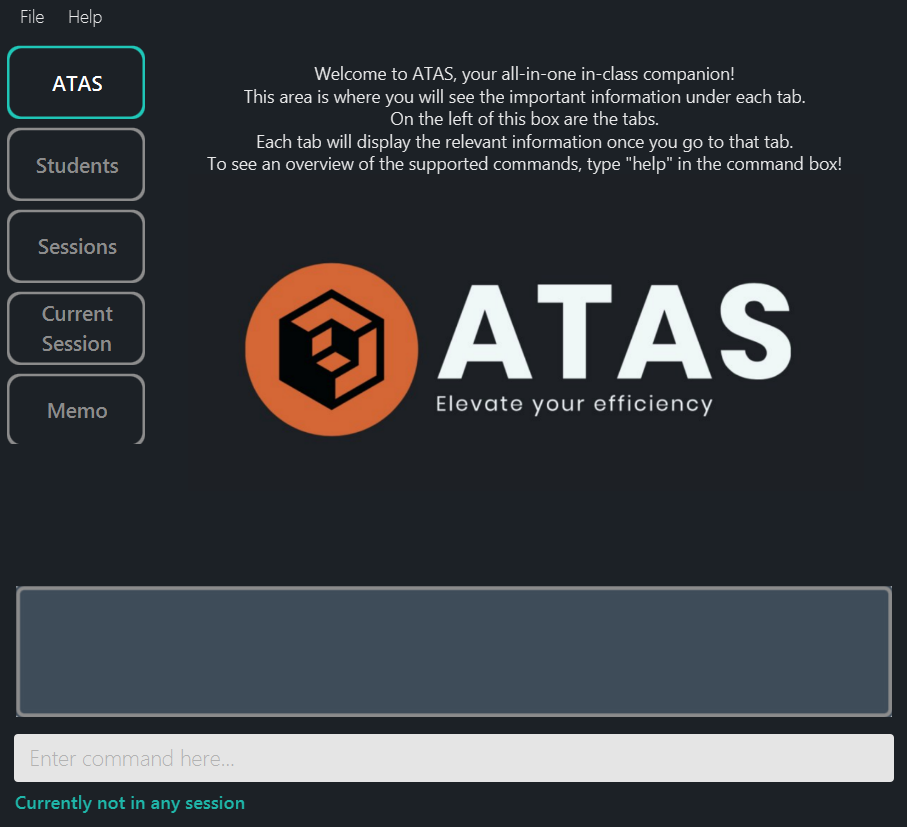
  
  <b>Figure 11.1.1</b>: Application view of the expected window appearance upon launch  
 

1. Saving window preferences

  1. Resize the window to an optimum size. Move the window to a different location. Close the window.

  1. Re-launch the app by double-clicking the jar file. 
      Expected: The most recent window size and location is retained.

{ end of `manual_testing#launch_and_shutdown` written by: Masagca Eris Jacey }

{ start of `manual_testing#adding_a_student` written by: Ngoh Wei Yue }

### 11.2. Adding a student

  1. Adding a student while all students are being shown.
  
  1. Prerequisites: List all students using the list command. No students with the same matriculation number or NUS email address as any of the students to be added during testing.

  1. Test case: `addstu n/Alvin Boon m/A0123456X e/alvinboon@u.nus.edu` 
     Expected: A student is added to the bottom of the student list. A success message including the particulars of the added student is shown in the result box.
     
     
     
  <b>Figure 11.2.1</b>: Application view when a student is successfully added  
 
     
  1. Test case: `addstu n/Cathy Duigan m/A1123456X e/cathyduigan@u.nus.edu t/helpful` 
       Expected: Similar to previous.
       
  1. Test case: `addstu m/A2123456X n/Elbert Foo e/elbertfoo@u.nus.edu` 
       Expected: Similar to previous.
       
  1. Test case: `addstu n/Gina Ho m/A3123456X` 
     Expected: No student is added. Error message indicating an invalid command format is shown in the result box.
     
     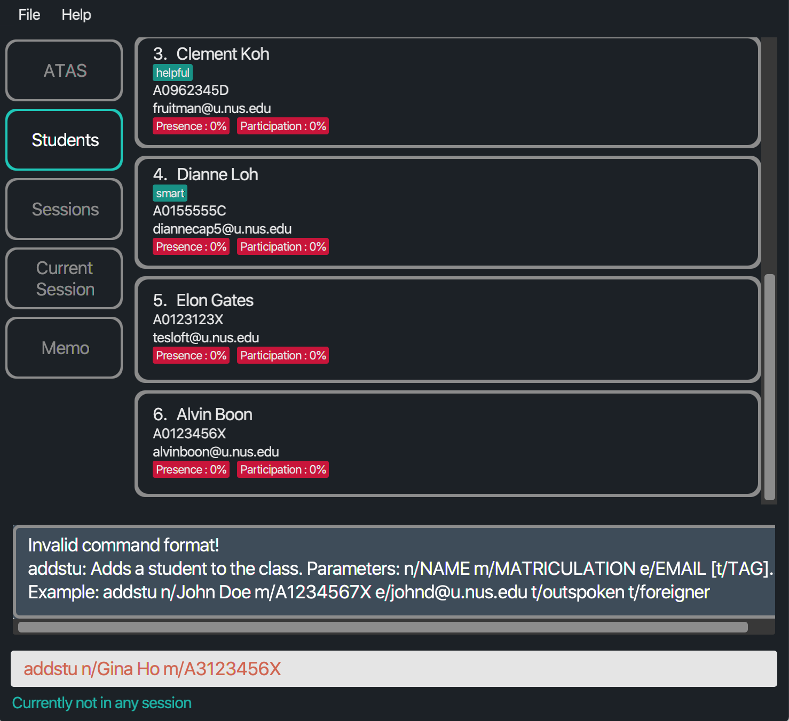
     
  <b>Figure 11.2.2</b>: Application view when a student is not successfully added  
 
     
  1. Test case: `addstu n/Gina Ho e/ginaho@u.nus.edu` 
     Expected: Similar to previous.
     
  1. Test case: `addstu m/A3123456X e/ginaho@u.nus.edu` 
     Expected: Similar to previous.
       
  1. Test case: `addstu n/Gina Ho m/A31234567 e/ginaho@u.nus.edu` 
     Expected: No student is added. Error message indicating an invalid matric number is shown in the result box.
     
  1. Test case: `addstu n/Gina Ho m/A3123456X e/ginaho@u.ntu.edu` 
     Expected: No student is added. Error message indicating an invalid NUS email address is shown in the result box.
     
  1. Test case: `addstu n/Gina Ho m/A0123456X e/ginaho@u.nus.edu` 
       Expected: No student is added. Error message indicating that the student already exists is shown in the result box.
       
  1. Test case: `addstu n/Gina Ho m/A3123456X e/elbertfoo@u.nus.edu` 
       Expected: No student is added. Error message indicating that the student already exists is shown in the result box.
     
  
:information_source: 
  **Note:** The above list of test cases is not exhaustive. Please feel free to add more.
  

{ end of `manual_testing#adding_a_student` written by: Ngoh Wei Yue }

{ start of `manual_testing#deleting_a_student` written by: Marcus Tan Wei }

### 11.3. Deleting a student

1. Deleting a student while all students are being shown

  1. Prerequisites: List all students using the `liststu` command. Multiple (but less than 100) students in the list.

  1. Test case: `deletestu 1` 
     Expected: First contact is deleted from the list. Details of the deleted contact shown in the ResultDisplay.

  1. Test case: `deletestu 0` 
     Expected: No student is deleted. Error details shown in the ResultDisplay. 

  1. Test case: `deletestu 101` 
     Expected: No student is deleted. Error details shown in the ResultDisplay.
     
  1. Other incorrect delete commands to try: `deletestu`, `deletestu x`, `...` (where x is larger than the list size) 
     Expected: Similar to previous.

1. Deleting a student while only some students are being shown
   
   1. Prerequisites: List some students using `findstu` command. Multiple (but less than 100) students are in the list.
   One or more (but less than 100) student is shown in the StudentListPanel.
   
   1. Test case: `deletestu 1` 
      Expected: First contact is deleted from the list. Details of the deleted contact shown in the ResultDisplay.
   
   1. Test case: `deletestu 0` 
      Expected: No student is deleted. Error details shown in the ResultDisplay. 
   
   1. Test case: `deletestu 101` 
      Expected: No student is deleted. Error details shown in the ResultDisplay.
      
   1. Other incorrect delete commands to try: `deletestu`, `deletestu x`, `...` (where x is larger than the list size) 
      Expected: Similar to previous.

{ end of `manual_testing#deleting_a_student` written by: Marcus Tan Wei }

{ start of `manual_testing#adding_a_session` written by: ________ }

### 11.4. Adding a session

todo

{ end of `manual_testing#adding_a_session` written by: ________ }

{ start of `manual_testing#deleting_a_session` written by: ________ }

### 11.5. Deleting a session

todo

{ end of `manual_testing#deleting_a_session` written by: ________ }

{ start of `appendix` written by: _________ }

## 12. Appendix: effort

**Difficulty level:**

* todo

**Challenges faced:**

* todo

**Effort required:**

* todo

**Achievements:**

* todo

{ end of `appendix` written by: _________ }
