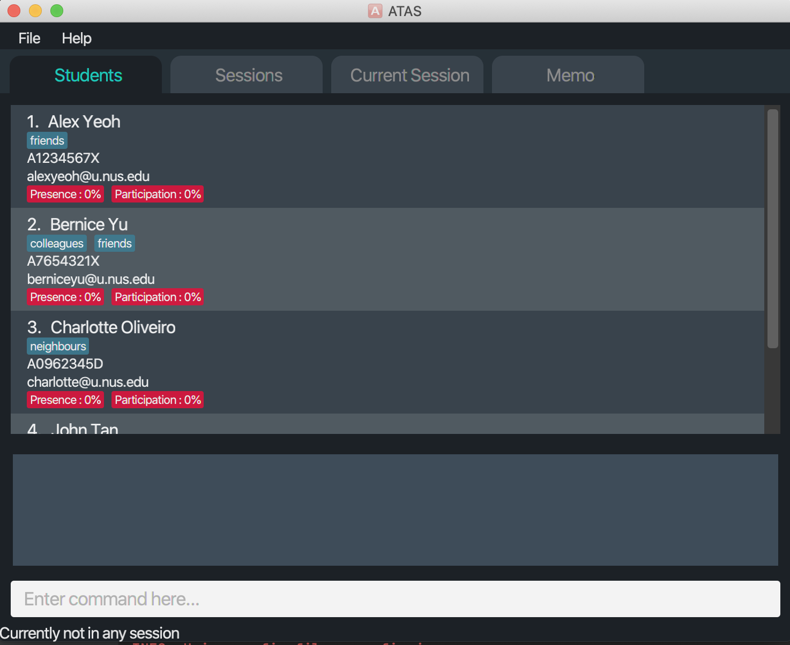
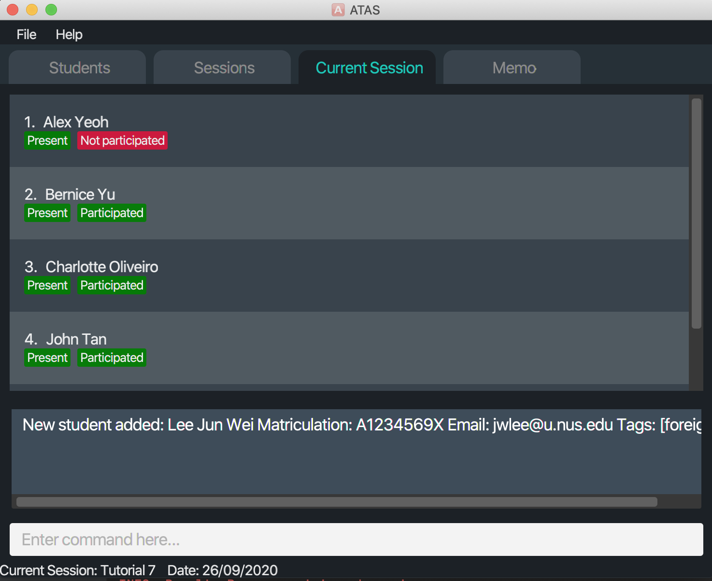
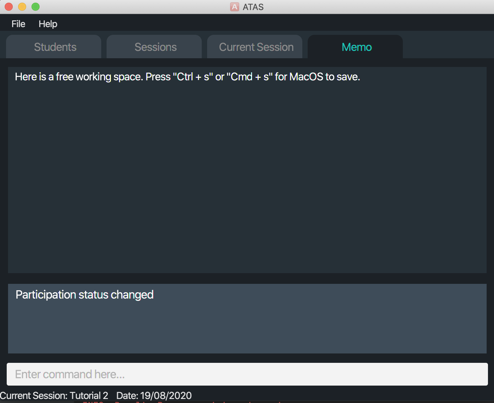
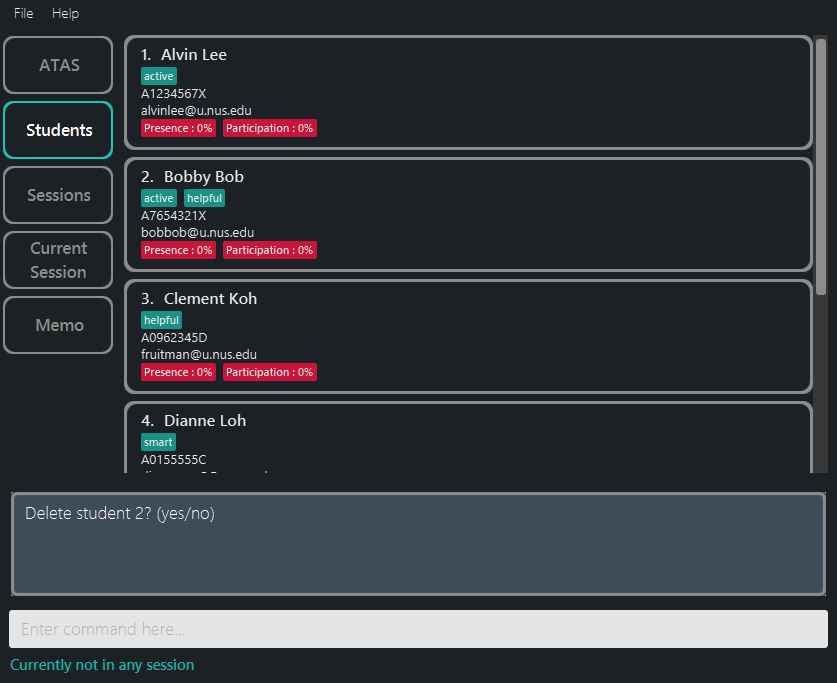
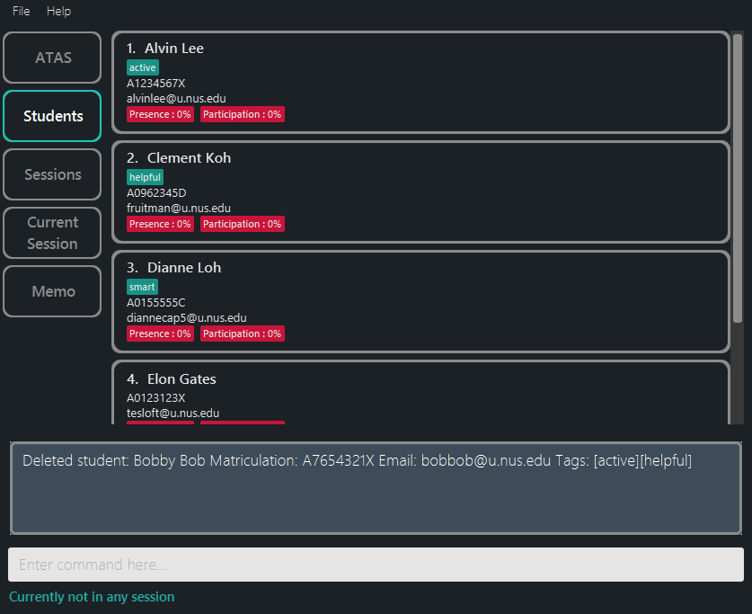
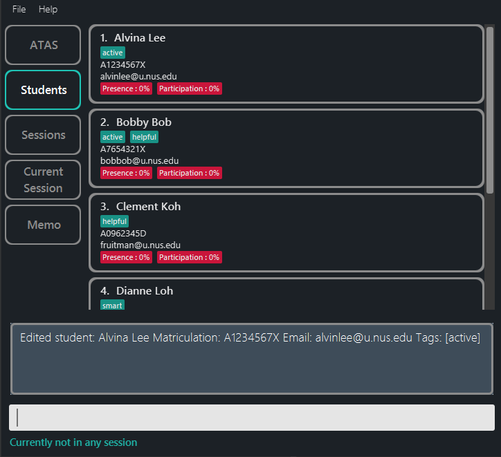
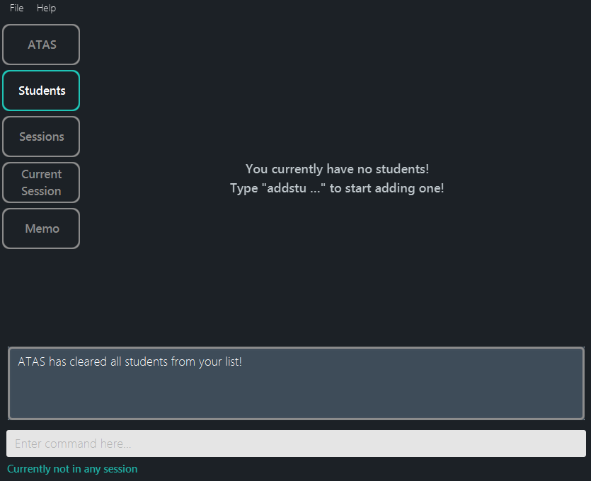
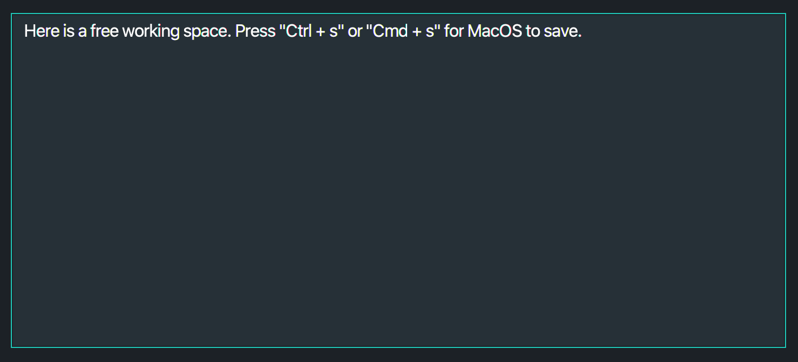

{ start of `table_of_contents` written by: Masagca Eris Jacey }

<div class="toc-no-list-style">
  * Table of contents
  {:toc}
</div>

{ end of `table_of_contents` written by: Masagca Eris Jacey }

--------------------------------------------------------------------------------------------------------------------

## 1. Introduction

{ start of `introduction#elevate_your_efficiency` written by: Masagca Eris Jacey }

### 1.1. Elevate your efficiency

Hello, fellow teaching assistants of CS1010S!

Have you ever struggled with keeping track of _all_ your students' attendance and participation status for each of your classes?

Have you ever needed to make a mental note in class, only to forget about it because there was no convenient place to write it in?

Have you ever wished an application would have a more streamlined **Command Line Interface** to suit your typing prowess?

If you found yourself saying yes to any of the above, then **ATAS (Addendum for Teaching Assistants)** is ***the*** *in-class management application* for you!
Made by teaching assistants, for teaching assistants, **ATAS** aims to *elevate your efficiency* and make your experience handling administrative tasks while in class as seamless as possible.

{ end of `introduction` written by: Masagca Eris Jacey }

{ start of `introduction#overview` written by: Masagca Eris Jacey }

### 1.2. Overview

**ATAS** is a **desktop application designed to be your handy in-class companion, optimized for use via a Command Line Interface** (CLI) while still having the benefits of a Graphical User Interface (GUI).
If you can type really quickly, **ATAS** will help you to manage your in-class administrative needs more efficiently than traditional GUI apps.

<div markdown="block" class="alert alert-info">

:information_source: Going forward, to minimize ambiguity, the following terms will be named as such: <br>
* `classes` will be henceforth referred to as `sessions`.
* `attendance` (of student(s)) will be henceforth referred to as `presence`.

See the parts under `session` and `presence` in the [glossary](#22-glossary) for more information.

</div>

Specifically, **ATAS** allows you to keep track of four different aspects (see [Section 4 - Layout of ATAS](#4-layout-of-atas) for a graphical visualization for each aspect):

1. [Students](#41-students)
   * Keep track of all students assigned to you
   * Store their matriculation number, NUS e-mail, and relevant [tag(s)](#22-glossary) (if any)
1. [Sessions](#42-sessions)
   * Keep track of all sessions you will be holding for the academic year
   * These will likely mostly consist of tutorial sessions, but can include consultations as well
1. [Current session](#43-current-session)
   * Keep track of student progress within each session itself
   * Specifically, for each session, keep track of each student's [`participation`](#551-toggling-participation-status-of-students--participate) and [`presence`](#552-toggling-presence-status-of-students--presence)
1. [Memo](#44-memo):
   * Keep track of any note you think you will need to remember for later use
   * For example, take note of any interesting question raised by your student so you can follow it up with him/her after the session

{ end of `introduction#overview` written by: Masagca Eris Jacey }

{ start of `introduction#preview` written by: Marcus Tan Wei }

### 1.3. Preview

The following is the GUI of our application:
    
    <p align="center"> <sub> <b>Figure 1.3</b>: UI Preview </sub> </p>
    

GUI Components:
   1. **Command box**: where you enter your commands.
   1. **Result box**: where the result of a command is shown. It can show a success message or a failure message if something wrong happens.
   1. **Tabs**: shows what item type you are viewing.

{ end of `introduction#preview` written by: Marcus Tan Wei }

--------------------------------------------------------------------------------------------------------------------

{ start of `about_this_user_guide` written by: Masagca Eris Jacey }

## 2. About this user guide

Our aim when writing this user guide is to help you - a new user - to get started with **ATAS** as quickly as possible.
This includes providing you with all the information you will need as *concisely as possible* to start using **ATAS**.
This guide features all the available commands, their syntax, as well as specific examples for illustration purposes.

{ end of `about_this_user_guide` written by: Masagca Eris Jacey }

{ start of `about_this_user_guide#navigation` written by: Masagca Eris Jacey }

### 2.1. Navigation

To help ease your navigation within this document, we have included numbers for each header, as well as links to their respective part (in the table of contents, and whenever they are referenced) in the guide.

Additionally, here are the relevant places you can go to if you would like to seek clarification on more specific parts:
* If you would like to get started on using **ATAS**, head over to [Section 3 - Quick start](#3-quick-start).
* If you would like to see the features available for **ATAS**, head over to [Section 5 - Features](#5-features).
* If you would like a quick summary of the available commands for **ATAS**, head over to [Section 7 - Command summary](#7-command-summary).

{ end of `about_this_user_guide#navigation` written by: Masagca Eris Jacey }

{ start of `about_this_user_guide#glossary` written by: Marcus Tan Wei }

### 2.2. Glossary

You will come across some of these terms in this document, and it will be good to have a clear understanding of what these terms mean.

|Term |Explanation |
|-----|------------|
|command | A line of text that you can type into the command box for the application to execute. |
|GUI | Graphical User Interface (GUI) is a type of user interface through which user interacts with electronic devices through visual representations. |
|index | The position of an item (student or session) in a displayed list. For simplicity, indexes start from 1. |
|memo | A brief written message written by you for note-taking. |
|parameter| Specific information that you input. |
|participate | An attribute indicating if a student has participated in the session or not. |
|presence | An attribute indicating if a student is present in the session or not. |
|session | A tutorial session or lesson that you conduct. |
|student | A person that is in your tutorial class. |
|tag(s) | Keyword(s) tagged to a student for your own identification purpose. |
|Ui | User interface (Ui) is the means by which user and a computer system interact. |

{ end of `about_this_user_guide#glossary` written by: Marcus Tan Wei }

### 2.3. Symbols and formatting

For the good majority of visual learners, we figured to present information in a unique format with symbols of different shapes and colours to help you along reading this guide.

  |Symbol/Format | Explanation |
 |--------------|-------------|
 |:bulb: | Tips |
 |:green_book: | Example(s) |
 |:information_source: | Important information to take note |
 |`consolas font` | Representing a key term or a command |
 
--------------------------------------------------------------------------------------------------------------------

{ start of `quick_start` written by: Alvin Chee Teck Weng }

## 3. Quick start

1. Ensure you have Java `11` or above installed in your Computer.

2. If you do not have Java version `11` and above installed, download it from [here](https://www.oracle.com/java/technologies/javase-jdk11-downloads.html). Remember to choose the installer that fits your computer.

2. Download the latest `atas.jar` from [here](https://github.com/AY2021S1-CS2103T-W16-4/tp/releases). 

3. Copy the file to the folder you want to use as the home folder for your ATAS. All the data related to ATAS will be stored here.

4. Double-click the file to start the app. The GUI similar to the below image should appear in a few seconds. Note how the app contains some sample data.<br>
   

5. Type the command in the command box and press Enter to execute it. e.g. typing **`help`** and pressing Enter will open the help window.<br>
   Some example commands you can try:

   * **`liststu`** : Lists out all the students.

   * **`addstu n/John Cena m/A0123456X e/thechamp@u.nus.edu`** : Adds a student named `John Cena` to the student list.

   * **`deleteses 3`** : Deletes the 3rd session shown in the current session list.
   
   * **`editses 3 s/Tutorial 2`** : Edits the 3rd session name to `Tutorial 2`.

   * **`clearstu`** : Deletes all the students.

   * **`exit`** : Exits out of the application.

6. Refer to the [Features](#features) below for details of each command.

{ end of `quick_start` written by: Alvin Chee Teck Weng }

--------------------------------------------------------------------------------------------------------------------

{ start of `layout_of_atas` written by: Ngoh Wei Yue }

## 4. Layout of ATAS

Over here, you can get an idea of how the different aspects of **ATAS** look like. **ATAS** comprises of four different tabs, with each tab supporting [features](#5-features) of the different aspects of **ATAS**.

{ end of `layout_of_atas` written by: Ngoh Wei Yue }

{ start of `layout_of_atas#students` written by: Ngoh Wei Yue }

### 4.1. Students

The `Students` tab contains a list of the students in your class. In this tab, you can view your students' particulars such as their name, matriculation number, email and their overall presence and participation scores. The students are arranged in the order that you add them.

The following is how the `Students` tab looks like:



To find out which features are supported by the `Students` tab, you can head over to [Section 5.3 - Students](#53-students).

{ end of `layout_of_atas#students` written by: Ngoh Wei Yue }

{ start of `layout_of_atas#sessions` written by: Ngoh Wei Yue }

### 4.2. Sessions

Over at `Sessions` tab, you can find the list of sessions that you have. Each session will display details like their name, date and the overall percentage of students present and participating in that particular session. The sessions are sorted by their dates, starting from the latest at the top.

The following is how the `Sessions` tab looks like:


To find out which features are supported by the `Sessions` tab, you can head over to [Section 5.4 - Sessions](#54-sessions).

{ end of `layout_of_atas#sessions` written by: Ngoh Wei Yue }

{ start of `layout_of_atas#current_session` written by: Ngoh Wei Yue }

### 4.3. Current session

Similar to the `Students` tab, you can also view the list of your students in the `Current Session` tab. The difference is that you can only view the students name and also whether they are present or have participated for that particular session. Students are sorted base on the student list in the `Students` tab.

The following is how the `Current Session` tab looks like:



To find out which features are supported by the `Current Session` tab, you can head over to [Section 5.5 - Current session](#55-current-session).

{ end of `layout_of_atas#current_session` written by: Ngoh Wei Yue }

{ start of `layout_of_atas#memo` written by: Ngoh Wei Yue }

### 4.4. Memo

The `Memo` tab contains a text box where you can input any notes that you need for future references. The outline of the text box will change color when u click into it.

The following is how the `Memo` tab looks like:



To find out which features are supported by the `Memo` tab, you can head over to [Section 5.6 - Memo](#56-memo).

{ end of `layout_of_atas#memo` written by: Ngoh Wei Yue }

--------------------------------------------------------------------------------------------------------------------

## 5. Features

{ start of `features#overview` written by: Ngoh Wei Yue }

### 5.1. Overview
In this secton, you can find the details of all the available features in **ATAS**. We have grouped the features into 7 main groups, namely [General](#52-general), [Students](#53-students), [Sessions](#54-sessions), [Current session](#55-current-session), [Memo](#56-memo), [User confirmation](#57-user-confirmation), and [Saving the data](#58-saving-the-data). 

There are 2 main types of features:
1. Commands that you can execute in the command box or through keyboard shortcuts
1. Features that are already inplace and require no actions from you

With the exception of [save memo](#562-save-memo), all commands that are available can be executed regardless of which tab you are in.

<div markdown="block" class="alert alert-info">

**:information_source: Notes about the command format:**<br>

* Words in `UPPER_CASE` are placeholders to be replaced by you.<br>
  e.g. you should change `addstu n/STUDENT_NAME` to `addstu n/John Cena`.

* Items in square brackets are optional.<br>
  e.g you can use `n/NAME [t/TAG]` as `n/John Cena t/foreigner` or simply as `n/John Cena`.

* Items with `…`​ after them can be used multiple times including zero times.<br>
  e.g. you can use `[t/TAG]…​` as ` ` (i.e. 0 times), `t/foreigner`(i.e. 1 time), `t/foreigner t/enthusiastic`(i.e. 2 times) etc.

* Parameters can be in any order.<br>
  e.g. if the command specifies `n/NAME m/MATRICULATION_NUMBER`, `m/MATRICULATION_NUMBER n/NAME` is also acceptable. 

</div>

{ end of `features#overview` written by: Ngoh Wei Yue }

{ start of `features#general` written by: Ngoh Wei Yue }

### 5.2. General

This category consists of conventional features (`help`, `exit`, `undo` and `redo`) that you can find in most applications. It also consists of features that are  responsible for navigating through **ATAS** (`switch`) and those that have no specific relation to any of the other categories below (`rng`).

{ end of `features#general` written by: Ngoh Wei Yue }

{ start of `features#general#help` written by: Ngoh Wei Yue }

#### 5.2.1. Viewing help : `help`

Opens a popup window to show the list of available commands and a link to access this user guide.

The following is how the help window looks like:


**Format:**
```
help
```

**Expected result:**
```
Opened help window
```

{ end of `features#general#help` written by: Ngoh Wei Yue }

{ start of `features#general#switch` written by: Ngoh Wei Yue }

#### 5.2.2. Switching between tabs : `switch`

Switches between tabs.

**Format:**
```
switch TAB_NAME
```
**:information_source: Notes about the usage of this command:**<br>
* `TAB_NAME` is case-insensitive.
* `Current` replaces `Current Session` as `TAB_NAME` here for simplicity.
* `TAB_NAME` must be an existing tab (`Students`, `Sessions`, `Current` or `Memo`).


**Expected result:**
```
Switched to TAB_NAME tab
```
Example:
* `switch sessions` switches to the `Sessions` tab.

{ end of `features#general#switch` written by: Ngoh Wei Yue }

{ start of `features#general#rng` written by: Masagca Eris Jacey }

#### 5.2.3. Generating the name of a randomly-selected student : `rng`

Chooses a student at random from the student list.

**Format:**
```
rng
```

**Expected result:**
```
Student selected: NAME_OF_RANDOMLY_SELECTED_STUDENT
```

{ end of `features#general#rng` written by: Masagca Eris Jacey }

{ start of `features#general#undo` written by: Masagca Eris Jacey }

#### 5.2.4. Undo-ing a command : `undo`

Undoes a command and essentially returns ATAS to the state prior to performing that command.

<div markdown="block" class="alert alert-info">

**:information_source: Notes about the usage of this command:**<br>

* An `undo` is done *per command* and not per change. If you make multiple changes to a student, for example, using a single `editstu` command, then `undo` will revert *all* the changes.
* Commands that can be undone are:
   * Adding a student/session: `addstu` / `addses`
   * Deleting a student/session: `deletestu` / `deleteses`
   * Editing a student/session: `editstu` / `editses`
   * Clearing all students/sessions: `clearstu` / `clearses`
   * Toggling the participation status of students: `participate`
   * Toggling the presence status of students: `presence`
* Commands not stated above make no change to the application state and thus cannot be undone.
* Successive `undo` commands will bring the application state further back, until there are no more changes to `undo`.
* You cannot `undo` if there is no previous state to return to.

</div>

**Format:**
```
undo
```

**Expected result:**
```
Previous command successfuly undone!
```

{ end of `features#general#undo` written by: Masagca Eris Jacey }

{ start of `features#general#redo` written by: Masagca Eris Jacey }

#### 5.2.5. Redo-ing a command : `redo`

Redoes a command that was most recently undone and returns ATAS to the state after having performed that command.

Essentially the reverse of undo-ing a command.

<div markdown="block" class="alert alert-info">

**:information_source: Notes about the usage of this command:**<br>

* A `redo` is done *per command* and not per change. If you undo a command that makes multiple changes (like `editstu`), then `redo` will recover *all* changes.
* If any of [the commands that support `undo`](#524-undo-ing-a-command--undo) is performed after an `undo`, then all states currently available for `redo` will be erased and you will not be able to go to those states anymore.
* You cannot `redo` if there is no forward state to go to.

</div>

**Format:**
```
redo
```

**Expected result:**
```
Previous command successfuly redone!
```

{ end of `features#general#redo` written by: Masagca Eris Jacey }

{ start of `features#general#exit` written by: Alvin Chee Teck Weng }

#### 5.2.6. Exiting the program : `exit`

Exits the application.

**Format:**
```
exit
```

**Expected result:**
```
Program window will be closed.
```

{ end of `features#general#exit` written by: Alvin Chee Teck Weng }

### 5.3. Students

{ start of `features#students` written by: Zhang Sheng Yang }
<br/>
<br/>
With ATAS, you can easily manage your students in your class!
<br/>
- First, at the start of a semester, you can use `addstu` and `deletestu` to include or remove 
students in your class. You can also edit student's particulars with `editstu` if you want to change any of
the student's details.
- Next, if you want to find any student or students, you can try `findstu` to search the class for 
the student you are looking for with a keyword, your class will now only show the the student or students you've 
searched for. When you are done, you can simply use `liststu` to view the entire class again!
- Finally, you might want to have an empty class to get ready for the next semester. In this case, instead of removing 
the students one by one, you can utilize `clearstu` to empty the class.
<br/>
<br/>

{ end of `features#students` written by: Zhang Sheng Yang }

#### 5.3.1. Adding a student : `addstu`

Adds a student to the student list.

```
addstu n/NAME m/MATRICULATION_NUMBER e/NUS_EMAIL_ADDRESS [t/TAG]…
```

:bulb: **Tip:** A student can have any number of tags (including 0) 

Examples:
* `addstu n/John Cena m/A0123456J e/thechamp@u.nus.edu`
* `addstu n/Alvina Handsome m/A0123456X e/handsome.alvina@u.nus.edu t/new`

#### 5.3.2. Listing all students : `liststu`

Shows a list of all students in the current student list.

```
liststu
```

#### 5.3.3. Locating students by name : `findstu`

Finds students whose names contain any of the given keywords.

```
findstu KEYWORD [MORE_KEYWORDS]
````

* The search is case-insensitive. e.g `john` will match `John`
* The order of the keywords does not matter. e.g. `John Cena` will match `Cena John`
* Only the name is searched.
* Only full words will be matched e.g. `Jon` will not match `John` 
* Students matching at least one keyword will be returned (i.e. `OR` search).
  e.g. `John Cena` will return `John Tan`, `Mark Cena`

Examples:
* `findstu John` returns `john` and `John Cena`
* `findstu kent ridge` returns `Kent Tan` and `Mark Ridge`<br>
[Insert image of an example of result of `findstu Cena`]

{ start of `features#student#deletestu` written by: Marcus Tan Wei }

#### 5.3.4. Deleting a student : `deletestu`

Removes a student from the student list.

<div markdown="block" class="alert alert-info">

**:information_source: Notes about the usage of this command:**<br>

* Deletes the student at the specified `INDEX`.
* The index refers to the index number shown in the displayed student list.
* The index **must be a positive integer** 1, 2, 3, …
* You will then be prompted for a confirmation input **`Delete student INDEX? (yes/no)`**.
   * If yes: deletes the specified student from the student list.
   * If no: the specified student remains in the student list.

</div>

**Format:**
```
deletestu INDEX
```

:information_source: After receiving the confirmation prompt, enter `yes` to confirm the removal of student at the specified `INDEX`, or reject the command by entering `no`.

<div markdown="block" class="alert alert-success">

:green_book: **Example:**

* `liststu` followed by `deletestu 2` followed by `yes`: Deletes and removes the 2nd student (**Figure 5.3.4-2**) from the student list.
* `findstu Bob` followed by `deletestu 1` followed by `yes`: Deletes and removes the 1st student from the results of the `findstu Bob` command.
</div>

**Outcome**


<p align="center"> <sub> <b>Figure 5.3.4-1</b>: Confirmation for deleting student 2 </sub> </p>
   

<p align="center"> <sub> <b>Figure 5.3.4-2</b>: After confirming the deletion of student 2 </sub> </p>   
   

Examples:

{ end of `features#student#deletestu` written by: Marcus Tan Wei }

{ start of `features#student#editstu` written by: Marcus Tan Wei }

#### 5.3.5. Editing a student's particulars : `editstu`

<div markdown="block" class="alert alert-info">

**:information_source: Notes about the usage of this command:**<br>

* Edits the student at the specified `INDEX` with the specified updated particular to be updated.
* The index refers to the index number shown in the displayed student list.
* The index **must be a positive integer** 1, 2, 3, …
* You will then be prompted for a confirmation input **`Edit student INDEX? (yes/no)`**.
   * If yes: edits and updates the particulars of the specified student from the student list.
   * If no: the specified student's particulars remains the same.

</div>

**Format:**
```
editstu INDEX (n/UPDATED_NAME) (e/UPDATED_EMAIL_ADDRESS) (m/UPDATED_MATRICULATION_NUMBER) (t/UPDATED_TAG)
```

<div markdown="block" class="alert alert-success">

:green_book: **Example:**

* `editstu 1 n/Alvina Lee` followed by `yes` : Edits the 2nd student (**Figure 5.3.5-1**) in the student list with an updated name `Alvina Lee`.
* `editstu 3 t/active` followed by `y`: Edits the 3rd student in the student list with an updated tag `active`.
</div>

:information_source: After receiving the confirmation prompt, enter `yes` to confirm the editing of student's particulars at the specified `INDEX`, or reject the command by entering `no`.

**Outcome:**


<p align="center"> <sub> <b>Figure 5.3.5</b>: After confirming the editing of student 2 (confirmation is similar to delete student, thus not shown)</sub> </p>   

{ end of `features#student#editstu` written by: Marcus Tan Wei }

{ start of `features#student#clearstu` written by: Marcus Tan Wei }

#### 5.3.6. Clearing the student list : `clearstu`

Clears and removes all students from the student list.

<div markdown="block" class="alert alert-info">

**:information_source: Notes about the usage of this command:**<br>
* You will then be prompted for a confirmation input **`Clear student list? (yes/no)`**.
   * If yes: removes all students from the student list.
   * If no: student list remains unchanged and no removal of students occurs.
   
</div>

**Format:**
```
clearstu
```

:information_source: After receiving the confirmation prompt, enter `yes` to confirm the removal of all students from the student list, or reject the command by entering `no`.

<div markdown="block" class="alert alert-success">

:green_book: **Example:**

* `clearstu` : Clears the students from the student list (**Figure 5.3.6-1**).
</div>

**Outcome:**

<p align="center"> <sub> <b>Figure 5.3.6</b>: Clearing the student list (confirmation is similar to delete student, thus not shown) </sub> </p>

{ end of `features#student#clearstu` written by: Marcus Tan Wei }

{ start of `sessions` written by: Alvin Chee Teck Weng }

### 5.4. Sessions
<br/>
<br/>
With **ATAS**, you can also manage each tutorial session efficiently!
<br/>
- First, at the start of each tutorial, you can use `addses` to add a tutorial session. If you have mistyped the session details, simply use `editses` or `deleteses` on the wrongly-typed session.
- Next, if you wish to change the presence and participation status of your students of a particular session, simply use `enterses` to enter that session to do so.
- Finally, you may want to take up the same teaching assistant job again for a different class in the next semester. All the tutorial sessions may now contain inaccurate details. In this case, instead of removing 
the sessions one by one, you can utilize `clearses` to remove all existing sessions.
<br/>
<br/>

#### 5.4.1. Adding a session : `addses`

Adds a session to the session list.

**Format:**
```
addses s/SESSION_NAME d/SESSION_DATE
```

**Expected result:**
```
New session added: Tutorial 4 @ 12/07/2020
```

**:information_source: Notes about the usage of this command:**<br>
* Adds a session with the specified name and date to the displayed session list.
* `SESSION_DATE` should be given in the format of d/M/yyyy or dd/MM/yyyy. This means if your day or month is single digit, you do not
need to add a '0' in front, for e.g., 09/01/2020 and 9/1/2020 are both accepted.

:bulb: **Tip:** Two sessions cannot have the same name but they can have the same date

Examples:
* `addses s/tut1 d/12/7/2020`

#### 5.4.2. Deleting a session : `deleteses`

Deletes a session from the session list.

**Format:**
```
deleteses INDEX
```

**Expected result:**
```
Delete INDEX? (yes/no)
```

:information_source: After receiving the confirmation prompt, enter `yes` to confirm the removal of session at the specified `INDEX` or reject the command by entering `no`.

**:information_source: Notes about the usage of this command:**<br>
* Deletes the session from the displayed session list at the specified `INDEX`.
* The index refers to the index number shown in the session list.
* The index **must be a positive integer** 1, 2, 3, …
* You will be prompted for a confirmation input **`(yes/no)`**.
   * If yes: the specified session will be removed from the session list.
      * If the specified `INDEX` is invalid, error message will appear.
   * If no: the specified session will not be removed from the session list.

Examples:
* `deleteses 1` followed by `no` results in nothing changed.
* `deleteses 2` followed by `yes` deletes the 2nd session in the session list.

#### 5.4.3. Editing a session : `editses`

Edits a session in the session list.

**Format:**
```
editses INDEX s/UPDATED_NAME d/UPDATED_DATE
```

**Expected result:**
```
Edit INDEX? (yes/no)
```

:information_source: After receiving the confirmation prompt, enter `yes` to confirm the update of session at the specified `INDEX` or reject the command by entering `no`.

:bulb: **Tip:** The updated session cannot have the same name as any of the other sessions in the list but they can have the same date

**:information_source: Notes about the usage of this command:**<br>
* Edits the session in the displayed session list at the specified `INDEX` with the specified details.
* The index refers to the index number shown in the session list.
* The index **must be a positive integer** 1, 2, 3, …
* You will be prompted for a confirmation input **`(yes/no)`**.
   * If yes: the specified session will be updated with the specified details.
   * If no: the specified session will not be updated.

Examples:
* `editses 2 s/Tutorial1 d/10/10/2020` followed by `yes` edits the 2nd session in the session list with a new session name `Tutorial1` and a new session date `10/10/2020`.

#### 5.4.4. Clearing the session list : `clearses`

Deletes all the sessions in the session list.

**Format:**
```
clearses
```

**Expected result:**
```
Clear session list? (yes/no)
```

:information_source: After receiving the confirmation prompt, enter `yes` to confirm the clearance of all sessions or reject the command by entering `no`.

**:information_source: Notes about the usage of this command:**<br>
* Clears all the sessions in the displayed session list.
* You will be prompted for a confirmation input **`(yes/no)`**.
   * If yes: all sessions will be removed from the session list.
   * If no: no sessions will be removed from the session list.
   
Examples:
* `clearses` followed by `yes` deletes all the sessions in the session list. 

#### 5.4.5. Entering a session : `enterses`

Enters a session in the session list.

**Format:**
```
enterses INDEX
```

**Expected result:**
```
Session entered: INDEX
```

**:information_source: Notes about the usage of this command:**<br>
* Enters the session in the displayed session list at the specified `INDEX`.
* The index refers to the index number shown in the session list.
* The index **must be a positive integer** 1, 2, 3, …

Examples:
* `enterses 1` enters the first session and allows you to use PARTICIPATE and PRESENCE commands.

{ end of `sessions` written by: Alvin Chee Teck Weng }

### 5.5. Current session

{ start of `features#current_session` written by: Zhang Sheng Yang }
<br/>
<br/>
After entering a session, which is mentioned above, you can now edit the presence and participation details
of a student. `participate` allows you to toggle the participation status (from absent to present or from 
present to absent), and `presence` allows you to toggle the presence status of a student (from not 
participated to participated or from participated to not participated).
<br/>
<br/>

{ end of `features#current_session` written by: Zhang Sheng Yang }

<br/>

#### 5.5.1. Toggling participation status of students : `participate`

Toggles the participation status of the students in the student list of the session.

```
participate INDEX_RANGE
```

* Toggles the participation status of the students at the specified `INDEX_RANGE`.
* The index range refers to the range of index numbers shown in the displayed student list of the session.
* The index range **must be a positive integer** 1, 2, 3, … OR **a positive index range** 1-4, 2-5, 2-9 … 

Examples:
* `participate 1-4` toggles the participation status of students 1 to 4.

#### 5.5.2. Toggling presence status of students : `presence`

Toggles the presence status of students in the student list of the session.

```
presence INDEX_RANGE
```

* Toggles the presence status of the students at the specified `INDEX_RANGE`.
* The index range refers to the range of index numbers shown in the displayed student list of the session.
* The index range **must be a positive integer** 1, 2, 3, … OR **a positive index range** 1-4, 2-5, 2-9 … 

Examples:
* `presence 1-4` toggles the presence status of students 1 to 4.

{ start of `features#memo` written by: Ngoh Wei Yue }

### 5.6. Memo

Under the `Memo` section, you can choose to `addnote` and save them when needed. 

{ end of `features#memo` written by: Ngoh Wei Yue }

{ start of `features#memo#addnote` written by: Ngoh Wei Yue }

#### 5.6.1. Adding a note : `addnote`

Adds a note to a new line at the end of memo.

**Format:**
```
addnote NOTE
```

**Expected result:**
```
Note added to memo!
```
Example:
* `addnote clarify qn 3 with prof` adds "clarify qn 3 with prof" to memo.

{ end of `features#memo#addnote` written by: Ngoh Wei Yue }

{ start of `features#memo#save_memo` written by: Ngoh Wei Yue }

#### 5.6.2. Save memo

Saves the content of the memo in the hard disk.

**Keyboard shortcut:**

Click on the text box in memo tab to bring focus to the text box. Text box should have a bright green outline when under focus.



Windows/Linux:
```
ctrl + s
```

MacOs:
```
cmd + s
```

**Expected result:**
```
Memo saved!
```

{ end of `features#memo#save_memo` written by: Ngoh Wei Yue }

{ start of `features#userconfirmation#clearstu` written by: Marcus Tan Wei }

### 5.7. User confirmation

Some commands have the ability to alter the data stored in the hard disk.
ATAS aims to make careful decisions and further prompts user to confirm the execution of those commands.
These commands are: [`deletestu`](#534-deleting-a-student--deletestu), [`editstu`](#535-editing-a-students-particulars--editstu),[`clearstu`](#536-clearing-the-student-list--clearstu),
[`deleteses`](#542-deleting-a-session--deleteses), [`editses`](#543-editing-a-session--editses) and [`clearses`](#544-clearing-the-session-list--clearses).

:bulb: **Tip:** For your convenience, both `yes` and `y` are accepted when confirming the execution of a command while both `no` and `n` are accepted when rejecting the execution of a command.

<div markdown="block" class="alert alert-success">

:green_book: **Example:**
* `deletestu 1` is followed with the following displayed message `Delete student 1? (yes/no)`.
* `editstu 3 n/UPDATED_STUDENT_NAME` is followed with the following displayed message `Edit student 3? (yes/no)`.
* `clearstu` is followed with the following displayed message `Clear student list? (yes/no)` (**Figure 5.7-1**).
* `deleteses 2` is followed with the following displayed message `Delete session 2? (yes/no)`.
* `editses 2 s/UPDATED_SESSION_NAME` is followed with the following displayed message `Edit session 3? (yes/no)`.
* `clearses` is followed with the following displayed message `Clear student list? (yes/no)`.
</div>

For example, confirmation of `clearstu` is shown above at [Section 5.3.6 - Clearing the student list](#536-clearing-the-student-list--clearstu).
In this case, we will show an example of the confirmation prompt following the `clearstu` command (**Figure 5.7-1**) and result of rejecting a `clearstu` command (**Figure 5.7-2**).

**Format:**
```
clearstu
```

<div markdown="block" class="alert alert-success">

:green_book: **Example:**

* `clearstu` followed by `no`: No removal of any students from the student list.
</div>

**Outcome:**


<p align="center"> <sub> <b>Figure 5.7-1</b>: Confirmation prompt after entering the clear student list command </sub> </p> 


<p align="center"> <sub> <b>Figure 5.7-2</b>: Clear student list command is rejected </sub> </p> 

{ end of `features#userconfirmation#clearstu` written by: Marcus Tan Wei }

{ start of `features#saving_the_data` written by: Ngoh Wei Yue }

### 5.8. Saving the data

`Students`, `Sessions` and `Memo` data are saved in the hard disk automatically after any command that changes the data. There is no need to save manually. However, you can also choose to manually save the `Memo` data if you want as described in [Section 5.6.2 - Save Memo](#562-save-memo).

{ end of `features#saving_the_data` written by: Ngoh Wei Yue }

--------------------------------------------------------------------------------------------------------------------

{ start of `faq` written by: Ngoh Wei Yue }

## 6. FAQ

**Q**: How do I transfer my data to another Computer?<br>
**A**: Install **ATAS** in the other computer and overwrite the empty data files it creates with the files that contains the data of your previous **ATAS** home folder. The previous data files can be found in the *data* folder in the same directory as your `atas.jar` file.

{ end of `faq` written by: Ngoh Wei Yue }

--------------------------------------------------------------------------------------------------------------------

{ start of `command_summary` written by: Masagca Eris Jacey }

## 7. Command summary

The following is a summary of all available commands for your reference.

{ end of `command_summary` written by: Masagca Eris Jacey }

{ start of `command_summary#general` written by: Masagca Eris Jacey }

### 7.1. General

Command | Format, Examples
--------|------------------
**Help** | `help`
**Switch** | `switch TAB_NAME`<br> e.g., `switch sessions`
**Random Name Generation** | `rng`
**Undo** | `undo`
**Redo** | `redo`
**Exit** | `exit`

{ end of `command_summary#general` written by: Masagca Eris Jacey }

### 7.2. Students

{ start of `command_summary#students` written by: Zhang Sheng Yang }
<br/>
<br/>
The following is a summary of commands related to students.

Command | Format, Examples
--------|------------------
**Add** | `addstu n/NAME m/MATRICULATION_NUMBER e/NUS_EMAIL_ADDRESS [t/TAG]…` <br/> e.g.,<br/> `addstu n/John Cena m/A0123456J e/thechamp@u.nus.edu`,<br/> `addstu n/Alvina Handsome m/A0123456X e/handsome.alvina@u.nus.edu t/new`
**List** | `liststu`
**Find** | `findstu KEYWORD [MORE_KEYWORDS]` <br/> e.g.,<br/> `findstu John`,<br/> `findstu kent ridge`
**Edit** | `editstu INDEX n/UPDATED_NAME` <br/> e.g.,<br/> `editstu 2 n/John Cena`,<br/> `editstu 3 t/Joker`
**Delete** | `deletestu INDEX` <br/> e.g.,<br/> `deletestu 2`
**Clear** | `clearstu`

<br/>

{ end of `command_summary#students` written by: Zhang Sheng Yang }

{ start of `command_summary#sessions` written by: Marcus Tan Wei}

### 7.3. Sessions

Command | Format, Examples
--------|------------------
**Add Session** | `addses s/SESSION_NAME d/SESSION_DATE` <br> e.g., `addses s/Tutorial 1 d/11/11/2020`
**Clear Sessions** | `clearses`
**Delete Session** | `deleteses INDEX`
**Edit Session** | `editses` <br> e.g., `editses 1 s/Lab 1`
**Enter Session** | `enterses INDEX`

{ end of `command_summary#sessions` written by: Marcus Tan Wei}

### 7.4. Current session

{ start of `command_summary#current_session` written by: Zhang Sheng Yang }
<br/>
<br/>
The following is a summary relevant commands after entering a session.

Command | Format, Examples
--------|------------------
**Participate** | `participate INDEX_RANGE` <br/> e.g., `participate 1-4`, `participate 3`
**Presence** | `presence INDEX_RANGE` <br/> e.g., `presence 2-3`, `presence 7`

<br/>

{ end of `command_summary#current_session` written by: Zhang Sheng Yang }

{ start of `command_summary#memo` written by: Ngoh Wei Yue }

### 7.5. Memo

Command | Format, Examples
--------|------------------
**Add Note** | `addnote NOTE`<br> e.g., `addnote clarify qn 3 with prof`
**Save Memo** | Keyboard shortcut: `Ctrl + s` for Windows/Linux or `Cmd + s` for MacOs

{ end of `command_summary#memo` written by: Ngoh Wei Yue }
