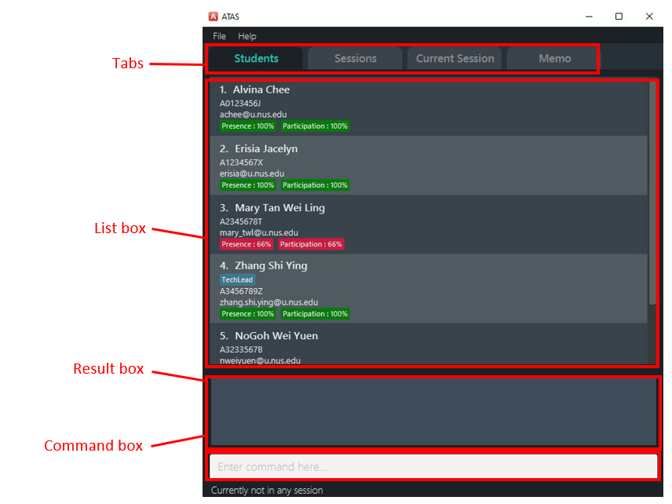
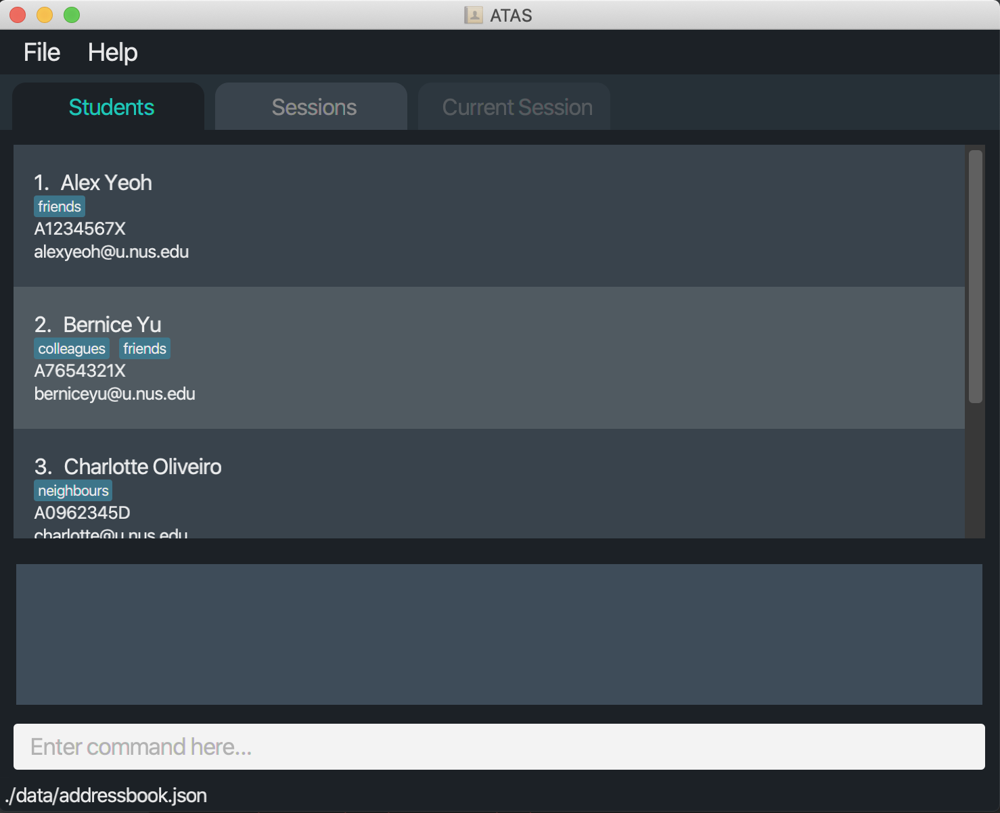
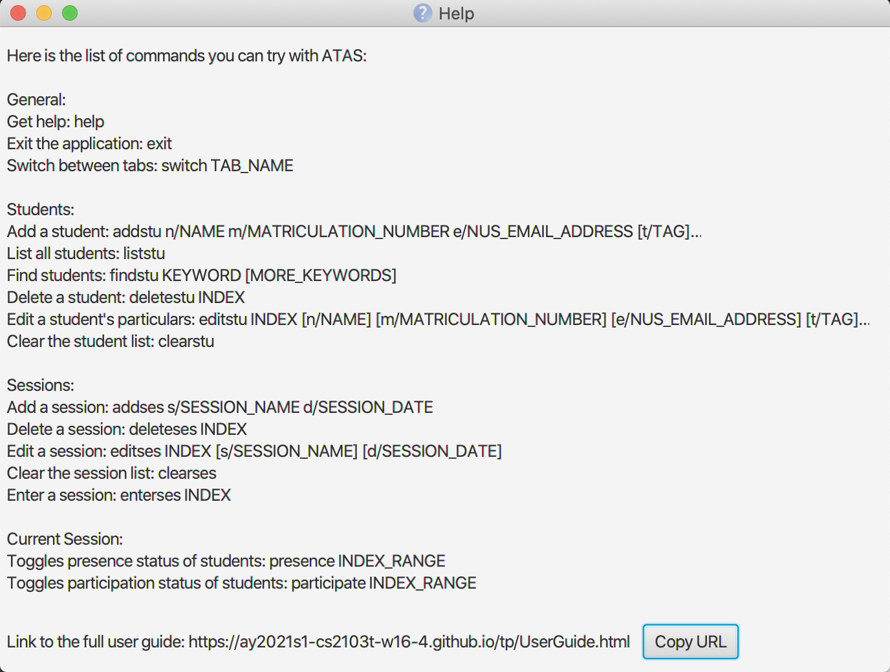
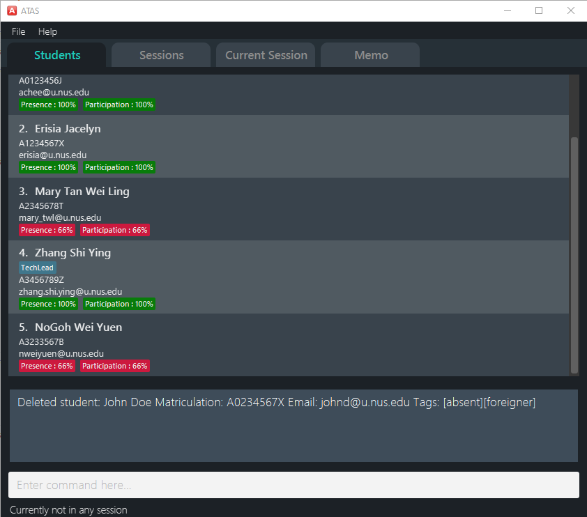
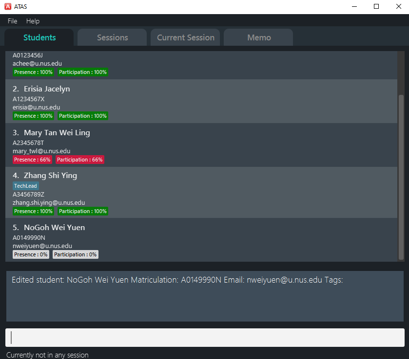
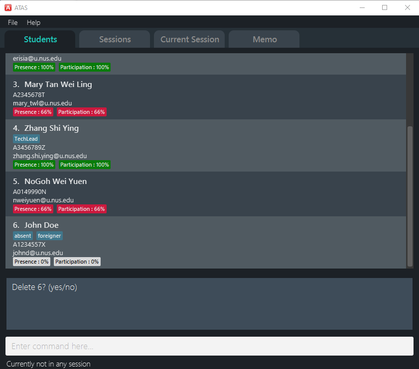
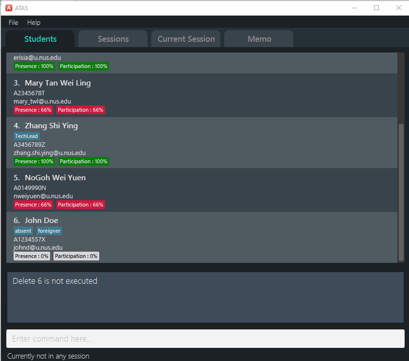

{ start of `table_of_contents` written by: Masagca Eris Jacey }

<div class="toc-no-list-style">
  * Table of contents
  {:toc}
</div>

{ end of `table_of_contents` written by: Masagca Eris Jacey }

--------------------------------------------------------------------------------------------------------------------

## 1. Introduction

{ start of `introduction#elevate_your_efficiency` written by: Masagca Eris Jacey }

### 1.1. Elevate your efficiency

Hello, fellow teaching assistants of CS1010S!

Have you ever struggled with keeping track of _all_ your students' attendance and participation status for each of your classes? 

Have you ever needed to make a mental note in class, only to forget about it because there was no convenient place to write it in?

Have you ever wished an application would have a more streamlined **Command Line Interface** to suit your typing prowess?

If you found yourself saying yes to any of the above, then **ATAS (Addendum for Teaching Assistants)** is ***the*** *in-class management application* for you! 
Made by teaching assistants, for teaching assistants, **ATAS** aims to *elevate your efficiency* and make your experience handling administrative tasks while in class as seamless as possible.

{ end of `introduction` written by: Masagca Eris Jacey }

{ start of `introduction#overview` written by: Masagca Eris Jacey }

### 1.2. Overview

**ATAS** is a **desktop application designed to be your handy in-class companion, optimized for use via a Command Line Interface** (CLI) while still having the benefits of a Graphical User Interface (GUI). 
If you can type really quickly, **ATAS** will help you to manage your in-class administrative needs more efficiently than traditional GUI apps.

<div markdown="block" class="alert alert-info">

:information_source: Going forward, to minimize ambiguity, the following terms will be named as such: <br>
* `classes` will be henceforth referred to as `sessions`.
* `attendance` (of student(s)) will be henceforth referred to as `presence`. 

See the parts under `session` and `presence` in the [glossary](#22-glossary) for more information.

</div>

Specifically, **ATAS** allows you to keep track of four different aspects (see [Section 4 - Layout of ATAS](#4-layout-of-atas) for a graphical visualization for each aspect):

1. [Students](#41-students)
   * Keep track of all students assigned to you
   * Store their matriculation number, NUS e-mail, and relevant [tag(s)](#22-glossary) (if any)
1. [Sessions](#42-sessions)
   * Keep track of all sessions you will be holding for the academic year
   * These will likely mostly consist of tutorial sessions, but can include consultations as well
1. [Current session](#43-current-session)
   * Keep track of student progress within each session itself
   * Specifically, for each session, keep track of each student's [`participation`](#551-toggling-participation-status-of-students--participate) and [`presence`](#552-toggling-presence-status-of-students--presence)
1. [Memo](#44-memo): 
   * Keep track of any note you think you will need to remember for later use
   * For example, take note of any interesting question raised by your student so you can follow it up with him/her after the session

{ end of `introduction#overview` written by: Masagca Eris Jacey }

{ start of `introduction#preview` written by: Marcus Tan Wei }

### 1.3. Preview

The following is the GUI of our application:
    
    
GUI Components:
   1. **Command box**: where you enter your commands.
   1. **Result box**: where the result of a command is shown. It can show a success message or a failure message if something wrong happens.
   1. **Tabs**: shows what item type you are viewing.
   1. **List box**: where the list of students, sessions or attendance attributes are shown. For example, if you are in `Students` tab, then a list of students and their particulars are shown. It includes a scrollbar for you to scroll down to view more students' particulars.

{ end of `introduction#preview` written by: Marcus Tan Wei }

--------------------------------------------------------------------------------------------------------------------

{ start of `about_this_user_guide` written by: Masagca Eris Jacey }

## 2. About this user guide

Our aim when writing this user guide is to help you - a new user - to get started with **ATAS** as quickly as possible.
This includes providing you with all the information you will need as *concisely as possible* to start using **ATAS**.
This guide features all the available commands, their syntax, as well as specific examples for illustration purposes.

{ end of `about_this_user_guide` written by: Masagca Eris Jacey }

{ start of `about_this_user_guide#navigation` written by: Masagca Eris Jacey }

### 2.1. Navigation

To help ease your navigation within this document, we have included numbers for each header, as well as links to their respective part (in the table of contents, and whenever they are referenced) in the guide.

Additionally, here are the relevant places you can go to if you would like to seek clarification on more specific parts:
* If you would like to get started on using **ATAS**, head over to [Section 3 - Quick start](#3-quick-start).
* If you would like to see the features available for **ATAS**, head over to [Section 5 - Features](#5-features).
* If you would like a quick summary of the available commands for **ATAS**, head over to [Section 7 - Command summary](#7-command-summary).

{ end of `about_this_user_guide#navigation` written by: Masagca Eris Jacey }

{ start of `about_this_user_guide#glossary` written by: Marcus Tan Wei }

### 2.2. Glossary

You will come across some of these terms in this document, and it will be good to have a clear understanding of what these terms mean.

|Term |Explanation |
|-----|------------|
|command | A line of text that you can type into the command box for the application to execute. |
|index | The position of an item (student or session) in a displayed list. For simplicity, indexes start from 1.|
|memo | A brief written message written by you for note-taking. |
|parameter| Specific information that you input. |
|participate | An attribute indicating if a student has participated in the session or not. |
|presence | An attribute indicating if a student is present in the session or not. |
|session | A tutorial session or lesson that you conduct. |
|student | A person that is in your tutorial class. |
|tag(s) | Keyword(s) tagged to a student for your own identification purpose. |

{ end of `about_this_user_guide#glossary` written by: Marcus Tan Wei }

### 2.3. Symbols and formatting

For the good majority of visual learners, we figured to present information in a unique format with symbols of different shapes and colours to help you along reading this guide.

  |Symbol/Format | Explanation |
 |--------------|-------------|
 |:bulb: | Tips |
 |:instruction_source: | Important information to take note |
 |``consolas font`` | Representing a keyterm or a command |
 
--------------------------------------------------------------------------------------------------------------------

## 3. Quick start

1. Ensure you have Java `11` or above installed in your Computer.

2. Download the latest `atas.jar` from [here](https://github.com/AY2021S1-CS2103T-W16-4/tp/releases). 

3. Copy the file to the folder you want to use as the _home folder_ for your ATAS.

4. Double-click the file to start the app. The GUI similar to the below image should appear in a few seconds. Note how the app contains some sample data.<br>
   

5. Type the command in the command box and press Enter to execute it. e.g. typing **`help`** and pressing Enter will open the help window.<br>
   Some example commands you can try:

   * **`liststu`** : Lists out all the students.

   * **`addstu n/John Cena m/A0123456X e/thechamp@u.nus.edu`** : Adds a student named `John Cena` to the student list.

   * **`deleteses 3`** : Deletes the 3rd session shown in the current session list.
   
   * **`editses 3 s/Tutorial 2`** : Edits the 3rd session name to `Tutorial 2`.

   * **`clearstu`** : Deletes all the students.

   * **`bye`** : Exits out of the application.

6. Refer to the [Features](#features) below for details of each command.

--------------------------------------------------------------------------------------------------------------------

## 4. Layout of ATAS

[general overview]

### 4.1. Students

[student overview]

### 4.2. Sessions

[sessions overview]

### 4.3. Current session

[current session overview]

### 4.4. Memo

[memo overview]

--------------------------------------------------------------------------------------------------------------------

## 5. Features

### 5.1. Overview

<div markdown="block" class="alert alert-info">

**:information_source: Notes about the command format:**<br>

* The words in `UPPER_CASE` are placeholders to be replaced by the user.<br>
  e.g. in `addstu n/STUDENT_NAME` should be changed to `addstu n/John Cena`.

* Items in square brackets are optional.<br>
  e.g `n/NAME [t/TAG]` can be used as `n/John Cena t/foreigner` or simply as `n/John Cena`.

* Items with `…`​ after them can be used multiple times including zero times.<br>
  e.g. `[t/TAG]…​` can be used as ` ` (i.e. 0 times), `t/foreigner`, `t/foreigner t/enthusiastic` etc.

* Parameters can be in any order.<br>
  e.g. if the command specifies `n/NAME m/MATRICULATION_NUMBER`, `m/MATRICULATION_NUMBER n/NAME` is also acceptable. 

</div>

### 5.2 General

[short overview]

#### 5.2.1. Viewing help : `help`

Shows the list of available commands and a link to access the user guide.



```
help
```

#### 5.2.2. Switching between tabs : `switch`

Switches between tabs.

```
switch TAB_NAME
```

* The tab name is case-insensitive.
* The tab must be an existing tab (students or sessions).
* `Current Session` can only be access using `enterses INDEX`.

Example:
* `switch sessions` switches from the current tab to the sessions tab.

{ start of `features#general#rng` written by: Masagca Eris Jacey }

#### 5.2.3. Generating the name of a randomly-selected student : `rng`

Chooses a student at random from the student list.

**Format:**
```
rng
```

**Expected result:**
```
Student selected: NAME_OF_RANDOMLY_SELECTED_STUDENT
```

{ end of `features#general#rng` written by: Masagca Eris Jacey }

{ start of `features#general#undo` written by: Masagca Eris Jacey }

#### 5.2.4. Undo-ing a command : `undo`

Undoes a command and essentially returns ATAS to the state prior to performing that command.

<div markdown="block" class="alert alert-info">

**:information_source: Notes about the usage of this command:**<br>

* An `undo` is done *per command* and not per change. If you make multiple changes to a student, for example, using a single `editstu` command, then `undo` will revert *all* the changes.
* Commands that can be undone are:
   * Adding a student/session: `addstu` / `addses`
   * Deleting a student/session: `deletestu` / `deleteses`
   * Editing a student/session: `editstu` / `editses`
   * Clearing all students/sessions: `clearstu` / `clearses`
   * Toggling the participation status of students: `participate`
   * Toggling the presence status of students: `presence`
* Commands not stated above make no change to the application state and thus cannot be undone.
* Successive `undo` commands will bring the application state further back, until there are no more changes to `undo`.
* You can `undo` if there is no previous state to return to.

</div>

**Format:**
```
undo
```

**Expected result:**
```
Previous command successfuly undone!
```

{ end of `features#general#undo` written by: Masagca Eris Jacey }

{ start of `features#general#redo` written by: Masagca Eris Jacey }

#### 5.2.5. Redo-ing a command : `redo`

Redoes a command that was most recently undone and returns ATAS to the state after having performed that command.

Essentially the reverse of undo-ing a command.

<div markdown="block" class="alert alert-info">

**:information_source: Notes about the usage of this command:**<br>

* A `redo` is done *per command* and not per change. If you undo a command that makes multiple changes (like `editstu`), then `redo` will recover *all* changes.
* If any of [the commands that support `undo`](#524-undo-ing-a-command--undo) is performed after an `undo`, then all states currently available for `redo` will be erased and you will not be able to go to those states anymore.
* You cannot `redo` if there is no forward state to go to.

</div>

<div>
**Format:**
```
redo
```

**Expected result:**
```
Previous command successfuly redone!
```

{ end of `features#general#redo` written by: Masagca Eris Jacey }

#### 5.2.6. Exiting the program : `bye`

Exits the application.

```
bye
```

### 5.3. Students

[short overview]

#### 5.3.1. Adding a student : `addstu`

Adds a student to the student list.

```
addstu n/NAME m/MATRICULATION_NUMBER e/NUS_EMAIL_ADDRESS [t/TAG]…
```

:bulb: **Tip:**<div markdown="span" class="alert alert-primary">
A student can have any number of tags (including 0) 


Examples:
* `addstu n/John Cena m/A0123456J e/thechamp@u.nus.edu`
* `addstu n/Alvina Handsome m/A0123456X e/handsome.alvina@u.nus.edu t/new`

#### 5.3.2. Listing all students : `liststu`

Shows a list of all students in the current student list.

```
liststu
```

#### 5.3.3. Locating students by name : `findstu`

Finds students whose names contain any of the given keywords.

```
findstu KEYWORD [MORE_KEYWORDS]
````

* The search is case-insensitive. e.g `john` will match `John`
* The order of the keywords does not matter. e.g. `John Cena` will match `Cena John`
* Only the name is searched.
* Only full words will be matched e.g. `Jon` will not match `John` 
* Students matching at least one keyword will be returned (i.e. `OR` search).
  e.g. `John Cena` will return `John Tan`, `Mark Cena`

Examples:
* `findstu John` returns `john` and `John Cena`
* `findstu kent ridge` returns `Kent Tan` and `Mark Ridge`<br>
[Insert image of an example of result of `findstu Cena`]

{ start of `features#student#deletestu` written by: Marcus Tan Wei }

#### 5.3.4. Deleting a student : `deletestu`

Removes a student from the student list.

<div markdown="block" class="alert alert-info">

**:information_source: Notes about the usage of this command:**<br>

* Deletes the student at the specified `INDEX`.
* The index refers to the index number shown in the displayed student list.
* The index **must be a positive integer** 1, 2, 3, …
* You will then be prompted for a confirmation input **`(yes/no)`**.
   * If yes: deletes the specified student from the student list.
   * If no: student will not be removed from the student list.

</div>

**Format:**
```
deletestu INDEX
```

**Expected result:**
```
Delete INDEX? (yes/no)
```

:instruction_source: After receiving the confirmation prompt, enter `yes` to confirm the removal of student at the specified `INDEX`, or else, reject the command by entering `no`.

**Format:**
```
yes
```

**Expected result:**
```
Deleted student: PARTICULARS_OF_STUDENT_AT_SPECIFIED_INDEX
```
   

Examples:
* `liststu` followed by `deletestu 2` followed by `yes` deletes the 2nd student in the student list.
* `findstu Betsy` followed by `deletestu 1` followed by `y` deletes the 1st student in the results of the `findstu Betsy` command.

{ end of `features#student#deletestu` written by: Marcus Tan Wei }

{ start of `features#student#editstu` written by: Marcus Tan Wei }

#### 5.3.5. Editing a student's particulars : `editstu`

<div markdown="block" class="alert alert-info">

**:information_source: Notes about the usage of this command:**<br>

* Edits the student at the specified `INDEX` with the specified updated particular to be updated.
* The index refers to the index number shown in the displayed student list.
* The index **must be a positive integer** 1, 2, 3, …
* You will then be prompted for a confirmation input **`(yes/no)`**.
   * If yes: edits and updates the particulars of the specified student from the student list.
   * If no: the specified student's particulars will not be edited.
   
</div>

**Format:**
```
editstu INDEX n/UPDATED_NAME
```

**Expected result:**
```
Edit INDEX? (yes/no)
```

:instruction_source: After receiving the confirmation prompt, enter `yes` to confirm the editing of student's particulars at the specified `INDEX`, or else, reject the command by entering `no`.

**Format:**
```
yes
```

**Expected result:**
```
Edited student: PARTICULARS_OF_STUDENT_AT_SPECIFIED_INDEX
```
   

Examples:
* `editstu 2 n/John Cena` followed by `yes` edits the 2nd student in the student list with an updated name `John Cena`.
* `editstu 3 t/Joker` followed by `y` edits the 3rd student in the student list with an updated tag `Joker`.

{ end of `features#student#editstu` written by: Marcus Tan Wei }

{ start of `features#student#clearstu` written by: Marcus Tan Wei }

#### 5.3.6. Clearing the student list : `clearstu`

Clears and removes all students from the student list.

<div markdown="block" class="alert alert-info">

**:information_source: Notes about the usage of this command:**<br>
* You will be prompted to confirm their decision here.
   * If yes: removes all students from the student list.
   * If no: student list will not be cleared.
   
</div>

**Format:**
```
clearstu
```

**Expected result:**
```
Clear list? (yes/no)
```

:information_source: After receiving the confirmation prompt, enter `yes` to confirm the removal of all students from the student list, or else, reject the command by entering `no`.

**Format:**
```
yes
```

**Expected result:**
```
ATAS has cleared all students from your list.
```

{ end of `features#student#clearstu` written by: Marcus Tan Wei }

#### 5.4. Sessions

[short overview]

#### 5.4.1. Adding a session : `addses`

Adds a session to session list.

```
addses s/SESSION_NAME d/SESSION_DATE
```

:bulb: **Tip:**<div markdown="span" class="alert alert-primary">
Two sessions cannot have the same name
</div>

Examples:
* `addses s/tut1 d/12/7/2020`

#### 5.4.2. Deleting a session : `deleteses`

The user will be prompted to confirm their decision here.

If yes: deletes the specified session from the session list.

```
deleteses INDEX
```

* Deletes the session at the specified `INDEX`.
* The index refers to the index number shown in the displayed session list.
* The index **must be a positive integer** 1, 2, 3, …
* User will then be prompted for a confirmation input **`(yes/no)`**.

Examples:
* `deleteses s/tut1 d/12/7/2020` followed by `yes` deletes the 2nd session in the session list.

#### 5.4.3. Clearing the session list : `clearses`

Deletes all the sessions in the session list.

```
clearses
```

#### 5.4.4. Editing a session : `editses`

The user will be prompted to confirm their decision here.

If yes: edits and updates the details of the specified session from the session list.

```
editses INDEX s/UPDATED_NAME d/UPDATED_DATE
```

* Edits the session at the specified `INDEX` with the specified details to be updated.
* The index refers to the index number shown in the displayed session list.
* The index **must be a positive integer** 1, 2, 3, …
* User will then be prompted for a confirmation input **`(yes/no)`**.

Examples:
* `editses 2 s/Tutorial1 d/10/10/2020` followed by `yes` edits the 2nd session in the session list with a new session name `Tutorial1` and a new session date `10/10/2020`.


#### 5.4.5. Entering a session : `enterses`

Enters a session in the session list.

```
enterses INDEX
```

* Enters the session at the specified `INDEX`.
* The index refers to the index number shown in the displayed session list.
* The index **must be a positive integer** 1, 2, 3, …

Examples:
* `enterses 1` enters the first session and allows you to use PARTICIPATE and PRESENCE commands.

### 5.5. Current session

[short overview]

#### 5.5.1. Toggling participation status of students : `participate`

Toggles the participation status of the students in the student list of the session.

```
participate INDEX_RANGE
```

* Toggles the participation status of the students at the specified `INDEX_RANGE`.
* The index range refers to the range of index numbers shown in the displayed student list of the session.
* The index range **must be a positive integer** 1, 2, 3, … OR **a positive index range** 1-4, 2-5, 2-9 … 

Examples:
* `participate 1-4` toggles the participation status of students 1 to 4.

#### 5.5.2. Toggling presence status of students : `presence`

Toggles the presence status of students in the student list of the session.

```
presence INDEX_RANGE
```

* Toggles the presence status of the students at the specified `INDEX_RANGE`.
* The index range refers to the range of index numbers shown in the displayed student list of the session.
* The index range **must be a positive integer** 1, 2, 3, … OR **a positive index range** 1-4, 2-5, 2-9 … 

Examples:
* `presence 1-4` toggles the presence status of students 1 to 4.

### 5.6. Memo

[short overview]

#### 5.6.1. ???

[todo]

{ start of `features#userconfirmation#clearstu` written by: Marcus Tan Wei }

### 5.7. User confirmation

Some commands have the ability to alter the data stored in the hard disk.
ATAS aims to make careful decisions and further prompts user to confirm the execution of those commands.
These commands are: `deletestu`, `editstu`,`clearstu`, `deleteses`, `editses`.

:bulb: **Tip:**<div markdown="span" class="alert alert-primary">
Both `yes` and `y` are accepted when confirming the execution of a command while `no` and `n` are both accepted when rejecting the execution of a command.

Examples:
* `deletestu 3` is followed with `Delete 3? (yes/no)`.
* `editses 3 s/SESSION_NAME` is followed with `Edit 3? (yes/no)`.
* `clearstu` is followed with `Clear list? (yes/no)`.

For example, confirmation of `deletestu` is shown above at [Section 5 - Features](#534-deleting-a-student--deletestu). In this case, we will show an example of rejection a `deletestu` command.

**Format:**
```
deletestu INDEX
```

**Expected result:**
```
Delete INDEX? (yes/no)
```
   

**Format:**
```
no
```

**Expected result:**
```
Delete INDEX is not executed
```
   

{ end of `features#userconfirmation#clearstu` written by: Marcus Tan Wei }

### 5.8. Saving the data

Students’ data are saved in the hard disk automatically after any command that changes the data. There is no need to save manually.

--------------------------------------------------------------------------------------------------------------------

## 6. FAQ

**Q**: How do I transfer my data to another Computer?<br>
**A**: Install the app in the other computer and overwrite the empty data file it creates with the file that contains the data of your previous ATAS home folder.

--------------------------------------------------------------------------------------------------------------------

{ start of `command_summary` written by: Masagca Eris Jacey }

## 7. Command summary

The following is a summary of all available commands for your reference.

{ end of `command_summary` written by: Masagca Eris Jacey }

{ start of `command_summary#general` written by: Masagca Eris Jacey }

### 7.1. General

Command | Format, Examples
--------|------------------
**Help** | `help`
**Switch** | `switch TAB_NAME`<br> e.g., `switch sessions`
**Random Name Generation** | `rng`
**Undo** | `undo`
**Redo** | `redo`
**Exit** | `bye`

{ end of `command_summary#general` written by: Masagca Eris Jacey }

### 7.2. Students

[students]

{ start of `command_summary#sessions` written by: Marcus Tan Wei}

### 7.3. Sessions

Command | Format, Examples
--------|------------------
**Add Session** | `addses s/SESSION_NAME d/SESSION_DATE` <br> e.g., `addses s/Tutorial 1 d/11/11/2020`
**Clear Sessions** | `clearses`
**Delete Session** | `deleteses INDEX`
**Edit Session** | `editses` <br> e.g., `editses 1 s/Lab 1`
**Enter Session** | `enterses INDEX`

{ end of `command_summary#sessions` written by: Marcus Tan Wei}

### 7.4. Current session

[current session]

### 7.5. Memo

[memo]
